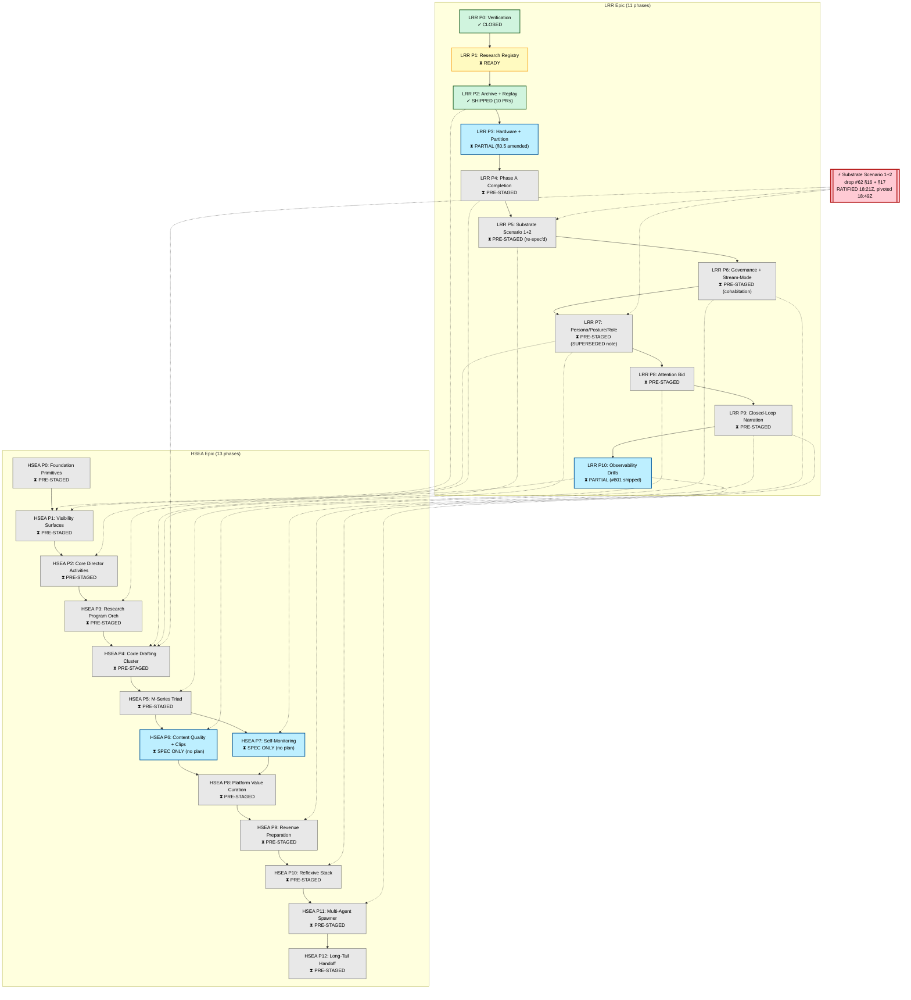

# Cross-epic dependency graph — LRR + HSEA

**Date:** 2026-04-15
**Author:** alpha (AWB mode, queue/ item #122)
**Scope:** Map LRR (Phases 0–10) × HSEA (Phases 0–12) dependencies, substrate gates, hardware gates, and execution ordering. Consolidates drop #62 fold-in table (§2) with current queue state.
**Register:** scientific, neutral
**Depends on:** queue #103 (LRR coverage audit), queue #108 (HSEA coverage audit)

## 1. Headline

**14 unified phases, 3 hard gates, 2 critical paths.** Post-§14 Hermes abandonment, the critical path changes.

**Hard gates** (block all downstream work until resolved):

1. **Substrate gate** — Phase B comparison requires a ratified alt-substrate (Qwen3.5-9B-only vs OLMo 3-7B or similar). Blocks LRR Phase 5 + HSEA Phase 4 I-cluster.
2. **Hardware gate (Hailo HAT)** — blocks HSEA Phase 5 M1 (biometric proactive intervention) + HSEA Phase 7 D2 (anomaly narration multi-modal).
3. **Hardware gate (ReSpeaker)** — blocks HSEA Phase 5 M-series (voice interception channel) + LRR Phase 8/9 (attention bid + code narration).

**Critical path (as of 2026-04-15T18:46Z, post-§14):**

```
HSEA Phase 0 (foundation primitives, 13 deliverables)
  ↓
LRR Phase 1 (research registry)
  ↓
LRR Phase 2 (archive + replay) ✓ SHIPPED (10 PRs, #801–#810)
  ↓
LRR Phase 4 (Phase A completion + OSF pre-reg)
  ↓
[substrate gate]  ← BLOCKED: alt-substrate selection pending
  ↓
LRR Phase 5 (previously Hermes 70B; now substrate swap, structurally
              unreachable until alt-substrate ratified)
  ↓
LRR Phase 6 (governance finalization + stream-mode axis)
  ↓
HSEA Phase 4 I-cluster (code drafting)
  ↓
HSEA Phase 2 (core director activities)
  ↓
HSEA Phase 6/7 (content quality + self-monitoring)
  ↓
LRR Phase 7/8/9 (persona + attention bid + closed-loop narration)
  ↓
HSEA Phase 10 (reflexive stack)
  ↓
HSEA Phase 11 (multi-agent spawner)
  ↓
HSEA Phase 12 (long-tail handoff)
  ↓
LRR Phase 10 (observability drills polish) ← PARALLEL-TRACK throughout
```

## 2. LRR × HSEA phase dependency matrix

From drop #62 §2 (phase-by-phase overlap matrix), supplemented by drop #62 §5 (unified phase sequence) + drop #62 §14 (Hermes abandonment impact):

| LRR Phase | HSEA dependency | Direction | Notes |
|---|---|---|---|
| LRR Phase 0 (verification) | none | standalone | ✓ CLOSED |
| LRR Phase 1 (research registry) | HSEA Phase 0 (0.1 prom-query, 0.2 spawn ledger) | LRR depends | registry consumers cite HSEA Phase 0 primitives |
| LRR Phase 2 (archive + replay) | HSEA Phase 1 (1.1 HUD overlay) reads archive | HSEA depends | ✓ LRR Phase 2 SHIPPED |
| LRR Phase 3 (hardware migration) | HSEA Phase 5 M-series (hardware dependency cross-check) | bidirectional | |
| LRR Phase 4 (Phase A completion) | HSEA Phase 3 (research program orch) reads Phase A data | HSEA depends | Phase 4 is where Phase A baseline ends + pre-reg files |
| LRR Phase 5 (substrate swap) | HSEA Phase 4 I4 (training regime narration) | bidirectional | **§14 drift: Phase 5 spec needs re-spec** |
| LRR Phase 6 (governance + stream-mode) | HSEA Phase 6 (B-cluster checks mode for clipability) + HSEA Phase 9 (revenue overlay default-hidden in `public`) | HSEA depends | LRR owns the axis |
| LRR Phase 7 (persona + posture + role) | HSEA Phase 2 (director activities), HSEA Phase 4 (code drafting) | HSEA depends | DF-1 resolution |
| LRR Phase 8 (attention bid) | HSEA Phase 5 M1 (biometric proactive intervention reuses attention-bid channel) | HSEA depends | One channel, multiple producers |
| LRR Phase 9 (closed-loop feedback + narration) | HSEA Phase 7 D-cluster (FSM recovery narration), HSEA Phase 11 G15 (CI-watch triager) | HSEA depends | LRR ships publishers |
| LRR Phase 10 (observability drills polish) | HSEA Phase 1 (1.1 HUD), HSEA Phase 5 M1 (HRV strip), HSEA Phase 7 D2 | bidirectional | LRR owns cardinality budget |

## 3. HSEA × LRR phase dependencies (reverse direction)

| HSEA Phase | LRR dependency | Direction | Notes |
|---|---|---|---|
| HSEA Phase 0 (foundation primitives) | none | standalone | spawn ledger + prom-query lib; 13 deliverables |
| HSEA Phase 1 (visibility surfaces) | LRR Phase 2 (archive reads), LRR Phase 10 (prom cardinality) | HSEA depends | 1.1 HUD overlay |
| HSEA Phase 2 (core director activities) | LRR Phase 7 (persona authoring) | HSEA depends | director role spec dependency |
| HSEA Phase 3 (research program orch) | LRR Phase 4 (Phase A data) | HSEA depends | reads Phase A results |
| HSEA Phase 4 (code drafting) | LRR Phase 6 (governance) + LRR Phase 7 (role) + LRR Phase 5 (substrate) | HSEA depends | I4 narration depends on training regime data |
| HSEA Phase 5 (M-series triad) | LRR Phase 3 (hardware) + LRR Phase 8 (attention bid channel) | HSEA depends | M1 biometric reuses attention-bid |
| HSEA Phase 6 (content quality + clip mining) | LRR Phase 6 (stream-mode axis: B-cluster checks mode) | HSEA depends | |
| HSEA Phase 7 (self-monitoring) | LRR Phase 9 (closed-loop narration publishers) | HSEA depends | D-cluster consumers |
| HSEA Phase 8 (platform value curation) | none | standalone | |
| HSEA Phase 9 (revenue preparation) | LRR Phase 6 (stream-mode `public` mode) | HSEA depends | H6 revenue overlay default-hidden in `public` |
| HSEA Phase 10 (reflexive stack) | LRR Phase 10 (observability) | bidirectional | |
| HSEA Phase 11 (multi-agent spawner) | LRR Phase 9 (closed-loop), LRR Phase 8 (attention bid) | HSEA depends | G15 CI-watch triager extends LRR publishers |
| HSEA Phase 12 (long-tail handoff) | HSEA Phase 11 (spawner) | HSEA internal | final retrospective |

## 4. Substrate gates (post-§14)

Substrate gates block phases whose research design depends on a specific LLM substrate.

| Gate | Blocks | Status | Remediation |
|---|---|---|---|
| Qwen3.5-9B (current production) | none | ✓ live | |
| **Hermes 3 70B** | LRR Phase 5 (as previously specced), `claim-shaikh-sft-vs-dpo` | ✗ **structurally blocked** (§14) | re-spec Phase 5 around alt-substrate pair; drop or reframe claim |
| **Alt-substrate selection** | LRR Phase 5 (post-§14), HSEA Phase 4 I4 (training regime narration) | **PENDING operator ratification** | awaiting delta's parallel-deploy design |
| 5b (five-body) | none (historical future-conditional; §13 retires) | ✗ structurally unreachable | no action needed (reframing only, no live data affected) |

## 5. Hardware gates

Hardware gates block phases whose implementation requires a specific hardware component.

| Gate | Blocks | Status | Remediation |
|---|---|---|---|
| **Hailo HAT** (Pi NPU offload) | HSEA Phase 5 M1 (biometric proactive), HSEA Phase 7 D2 (anomaly narration multi-modal) | **PENDING procurement + install** | see memory `project_pi6_sync_hub.md` |
| **ReSpeaker 4-mic** | HSEA Phase 5 M-series (voice interception channel), LRR Phase 8 (attention bid audio) | **PENDING install** | Friday ReSpeaker path per epsilon's Pi fleet updates |
| **Pi 5** | HSEA Phase 8 (platform value curation — higher-throughput edge inference) | ✓ Thursday install (per epsilon deployment plan) | |
| **70B VRAM** (24 GB peak) | LRR Phase 5 as spec'd | ✗ **structurally unreachable** (§14) | abandoned; see substrate gate |
| NoIR camera (3 pending) | full IR fleet coverage | **PENDING flash** | Pi-1 + Pi-2 pending per memory `project_ir_perception.md` |

## 6. Critical path analysis

### 6.1 Pre-§14 critical path (now obsolete)

```
HSEA P0 → LRR P1 → LRR P2 → LRR P3 → LRR P4 → LRR P5 (Hermes 70B swap)
  → HSEA P4 → HSEA P2 → HSEA P6/7 → LRR P7/8/9 → HSEA P10/11/12 → LRR P10
```

Length: ~14 phases serially, parallelism at P10 (observability throughout).

### 6.2 Post-§14 critical path (current)

```
HSEA P0 → LRR P1 → LRR P2 ✓ → LRR P4 (Phase A completion)
  → [SUBSTRATE GATE] ← blocks until alt-substrate ratified
  → LRR P5 (substrate swap, re-spec'd) → LRR P6 → HSEA P4 I-cluster
  → HSEA P2 → HSEA P6/7 → LRR P7/8/9 → HSEA P10/11/12 → LRR P10
```

Length: same 14 phases, but **substrate gate** creates a hard pause at LRR P4 → P5 transition until operator ratifies alt-substrate.

### 6.3 Bottleneck analysis

| Phase | Bottleneck reason | Est sessions |
|---|---|---|
| LRR Phase 4 | Phase A data collection (≥10 sessions) + OSF filing (manual steps) | 3-5 |
| LRR Phase 5 | substrate gate + re-spec authoring + deployment validation | 5-8 (post-unblock) |
| LRR Phase 7 | spec authoring (persona + posture + role); DF-1 resolution | 2-4 |
| HSEA Phase 4 I-cluster | code drafting automation — largest HSEA phase | 4-6 |
| HSEA Phase 11 | multi-agent spawner — structural extension of spawn ledger | 3-5 |

**Bottom line:** LRR Phase 5 is the biggest blocker. Until alt-substrate is selected, Phase 5 cannot be re-spec'd → downstream LRR + HSEA work can partially proceed (LRR P6 can ship independent of substrate; HSEA P0/P1/P2/P3 have no substrate dependency), but the full epic closes only after P5 executes.

## 7. Parallelism opportunities

Phases that can run in parallel (no dependency edges between them):

| Parallel set | Phases | Notes |
|---|---|---|
| Research-registry track | LRR P1, HSEA P3 | both read/write registry; HSEA P3 consumes Phase A data when available |
| Governance track | LRR P6, HSEA P8 | stream-mode axis + platform value curation |
| Code-automation track | HSEA P4 I-cluster (first 3-4 deliverables), LRR P7 | spec authoring + code drafting can overlap |
| Observability track | LRR P10 (all sub-items), HSEA P1, HSEA P7 | telemetry work parallelizable |
| Multi-agent track | HSEA P11 (spawn ledger extensions) + HSEA P10 (reflexive stack) | internal HSEA parallelism |

**Alpha's recommendation:** delta should populate queue items that can run in parallel across alpha + beta sessions. The operator's continuous-session directive (§15) enables this without handoff costs.

## 8. Critical-path-accelerating actions

1. **Resolve substrate gate.** Alt-substrate selection is the single largest unblocker. If OLMo 3-7B or similar is viable, LRR Phase 5 can re-start immediately.
2. **Pre-stage LRR Phase 5 re-spec.** While substrate selection is pending, draft two alternative Phase 5 specs (one for OLMo, one for Qwen-only null-hypothesis); operator picks one.
3. **Run Phase A in parallel with LRR Phase 1 completion.** LRR Phase 1 ships the research registry; Phase 4 runs Phase A sessions against it. These can overlap if the registry lands first.
4. **Ship HSEA Phase 0 fully** (13 deliverables). HSEA Phase 0 is the foundation for everything HSEA downstream. Not blocked by anything.
5. **Install Hailo HAT + ReSpeaker ASAP.** Hardware gates should not dominate critical path.

## 9. Cross-references to drop #62

| Drop #62 section | Content | This doc section |
|---|---|---|
| §1 | Executive summary | §1 (this doc) |
| §2 | Phase-by-phase overlap matrix | §2 + §3 (this doc) |
| §3 | Shared concept ownership | Not duplicated here (see drop #62 directly) |
| §4 | 70B vs 8B substrate swap resolution | §4 substrate gates (this doc) — superseded by §14 |
| §5 | Unified phase sequence | §6 critical path (this doc) |
| §10 | Cross-epic operator questions | Not applicable (ratified) |
| §11–§12 | §10 Q1 + Q2–Q10 ratifications | Not duplicated |
| §13 | 5b reframing | §4 substrate gates (this doc) |
| **§14** | **Hermes 3 70B abandonment** | **§4 + §6 (this doc) — primary driver of re-framing** |
| §15 | Operator continuous-session directive | Enables §7 parallelism recommendation |
| §15.4 | "Phase 10 is terminal" (post-#126 amend) | Reflected in §1 critical path diagram |

## 10. Open questions

1. **Alt-substrate selection:** when does operator ratify? (blocks LRR Phase 5 re-spec)
2. **LRR Phase 5 re-spec ownership:** alpha, beta, or delta drafts? (recommend parallel drafts, operator picks)
3. **HSEA Phase 6/7 plans:** both specs on main (PR #855), but plans unauthored (per queue #112 audit). Who authors? (recommend delta extends Phase 4/5 pattern)
4. **Hardware gate timing:** Hailo HAT + ReSpeaker install dates? (blocks HSEA Phase 5 M-series)

## 11. Closing

The LRR × HSEA dependency graph is largely unchanged from drop #62 §2 in its structure, but §14 Hermes abandonment has inserted a hard substrate gate at LRR Phase 4 → Phase 5. Alt-substrate selection is the single critical path accelerator. HSEA Phase 0 + LRR Phase 1 + LRR Phase 6 are all substrate-independent and can ship in parallel to unblock downstream consumers.

Branch-only commit per queue item #122 acceptance criteria.

## 12. References

- Drop #62 fold-in: `docs/research/2026-04-14-cross-epic-fold-in-lrr-hsea.md` (§2, §5, §14, §15)
- LRR epic spec: `docs/superpowers/specs/2026-04-14-livestream-research-ready-epic-design.md`
- HSEA epic spec: `docs/superpowers/specs/2026-04-14-hsea-epic-design.md`
- Queue #103 LRR coverage audit
- Queue #108 HSEA coverage audit
- Queue #112 HSEA branch-only reconciliation (identifies HSEA P6/P7 plan gap)
- Queue #126 LRR Phase 11 scope clarification (closes "Phase 10 terminal" ambiguity)
- Epsilon Pi fleet deployment plan: `docs/research/2026-04-15-pi-fleet-deployment-plan.md` (Pi 5 Thursday, ReSpeaker Friday)
- Memory: `project_pi6_sync_hub.md`, `project_ir_perception.md`

— alpha, 2026-04-15T18:50Z

---

## 13. Mermaid visual rendering (added 2026-04-15T21:07Z, queue #149)

Visual diagram companion to the §2/§3 matrices. Nodes colored by status (closed/shipped, in-progress, blocked/superseded, pre-staged, executable). Edges show dependency direction (upstream → downstream).



**Legend:**
- 🟢 **Shipped** — phase executed to completion (LRR P0 verification, P2 archive+replay)
- 🟡 **Ready** — prerequisites met, can execute (LRR P1 registry foundation)
- 🔵 **Partial** — some items shipped, others pending (LRR P3 hardware + §0.5 amendment, LRR P10 #801 + incremental work; HSEA P6/P7 spec-only)
- ⬜ **Pre-staged** — spec + plan authored, not yet executed (most phases)
- 🔴 **Ratified cross-cutting** — drop #62 §16 + §17 substrate scenario 1+2 annotation (affects LRR P5 + P7 + HSEA P4)

**Reading the diagram:**

- Solid arrows = within-epic sequential dependencies (LRR P0 → P1 → P2 → ...)
- Dashed arrows = cross-epic dependencies (e.g., LRR P5 → HSEA P4 means HSEA Phase 4 reads LRR Phase 5 substrate output)
- The red Substrate node represents the §16 + §17 cross-cutting decision that unblocks LRR P5 and re-scopes LRR P7 + HSEA P4

**Limitations of the diagram:**

1. Does not show **parallelism opportunities** (noted in §7 above) — alpha + beta can run multiple phases in parallel when dependencies permit
2. Does not show **critical path length** — use §6 for that analysis
3. Does not encode **effort estimates** — those live in the phase specs themselves
4. Renders natively on GitHub markdown + mermaid-cli + obsidian-mermaid plugins; may need local rendering for complex views

**Rendering tips:**

- GitHub: commit to main + view — renders inline
- Local: `mmdc -i <this-file> -o graph.png` or via obsidian-mermaid plugin
- Mermaid live editor: paste the code block into `https://mermaid.live/`

— alpha, 2026-04-15T21:08Z (queue #149 mermaid visual addition)
