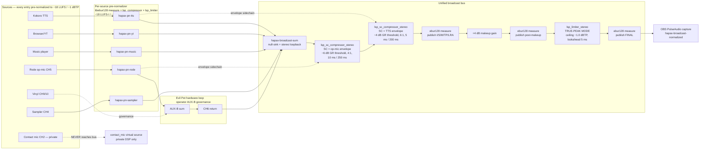

# Livestream Audio — Unified Architecture (one-time-forever)

## 1. Executive summary

### Problem
The operator has repeatedly had to "mess with faders" and Claude has repeatedly had to "adjust levels in software" because the broadcast chain is a stack of source-specific patches whose interactions are not modeled anywhere. Three load-bearing root causes:

1. **No master-bus loudness contract.** `hapax-broadcast-master` exists (`config/pipewire/hapax-broadcast-master.conf:1-109`) and IS RUNNING (`pactl list sinks short` confirms `hapax-broadcast-master` and `hapax-broadcast-normalized` both `RUNNING`), but the OBS source binds to `hapax-broadcast-normalized` only when the operator manually selects "Hapax Livestream Broadcast" in OBS Properties. There is no enforcement that the OBS scene IS reading the normalized source, no LUFS telemetry, and no alarm when the master limiter is being saturated. The "broadcast master" is decorative, not authoritative.
2. **Per-source loudness is multi-tuned, not multi-targeted.** `hapax-pc-loudnorm` (−16 dB threshold, 3:1, makeup −1 dB), `hapax-music-loudnorm` (−6 dB threshold, 1.5:1, makeup +1 dB), `hapax-loudnorm-capture` (−18 dB threshold, 3:1, makeup −12 dB), `hapax-yt-loudnorm` (−12 dB threshold, 4:1, makeup +2 dB) all use `sc4m_1916` + `hard_limiter_1413` but with hand-picked control values and no shared LUFS target constant. The "tuned to −18 LUFS via control values" claim is not verified anywhere — the system never measures its output. Operator drum-pumping incident on UNKNOWNTRON 2026-04-23 (forced creation of `hapax-music-loudnorm.conf`) is the proximate evidence.
3. **Ducking is dead, divergent, or the wrong shape.** Three independent ducking implementations exist:
   - `wireplumber.settings.linking.role-based.duck-level = 0.3` (correct shape, but the multimedia → `hapax-pc-loudnorm` retarget is RUNNING; the duck applies between role-loopbacks, and since music goes through `hapax-music-loudnorm` it is in the Multimedia loopback group too — but the duck only fires when `role.assistant` is *active*, which depends on TTS).
   - `agents/studio_compositor/audio_ducking.py` (4-state FSM, default OFF via `HAPAX_AUDIO_DUCKING_ACTIVE` flag, drives `hapax-ytube-ducked` and `hapax-24c-ducked` — both essentially dormant in the live system).
   - `vad_state_publisher.py` → `voice-state.json` → `hapax-livestream-duck` (filter-chain shipped but the publisher is dead code per `docs/research/2026-04-22-vad-ducking-pipeline-dead-finding.md`).
   None of the three is the canonical mechanism, and none reliably ducks the live music bed under the live operator voice.

### Proposed unified solution (one sentence)
**A single LUFS-targeted broadcast bus (`hapax-broadcast-master`, −14 LUFS-I / −1.0 dBTP, true-peak limited, libebur128-metered) that every source enters via a per-source pre-normalizer (−18 LUFS / −1 dBTP), with two and only two ducking signals (operator-VAD on the Rode + TTS-active from CPAL) feeding one declarative ducking matrix executed by `lsp-plugins`-based PipeWire sidechain compressors at the broadcast bus, all values derived from one constants module (`shared/audio_loudness.py`) so the operator and Claude never tune levels again — they tune *targets*, and the system enforces them.**

### Why this qualifies as "one time forever"
- **Targets, not gains.** The operator never sets a fader value. They set "voice should sit −4 LU above music," and the system emits the gain math.
- **Self-measuring.** `libpipewire-module-filter-chain`'s built-in `ebur128` plugin streams I-LUFS / S-LUFS / M-LUFS / TP / LRA from every source pre-normalizer and from the master bus to a Prometheus exporter. If a source drifts off target, the dashboard goes yellow before the operator hears it.
- **One config language.** Source declaration → topology → generated PipeWire confs (the Tier 1/2 schema from `docs/research/2026-04-20-unified-audio-architecture-design.md`, completed). Adding a source is a 1-PR, 1-file change. No new tuning, no new ducking carve-out.
- **Operator's L-12 faders go to unity and stay there.** The Evil Pet hardware loop is preserved (governance), but the L-12 channel trims become the only one-time analog calibration; the rest is digital and self-enforced.

---

## 2. Current-state inventory

### 2.1 Live PipeWire graph (probed 2026-04-23)

**RUNNING sinks (operator-relevant):**
| ID | Name | Class | State | Producer(s) |
|---|---|---|---|---|
| 45 | `hapax-livestream-tap` | null-sink + monitor | RUNNING | L-12 capture (via `hapax-l12-evilpet-playback`), S-4 (via `hapax-s4-tap`); monitor → OBS via `hapax-broadcast-master-capture` |
| 50 | `hapax-livestream` | null-sink | RUNNING | `hapax-livestream-tap-dst` loopback only |
| 82 | `hapax-music-loudnorm` | filter-chain (sc4m + hardLimiter) | RUNNING | `hapax-music-player.service` via pw-cat |
| 86 | `hapax-notification-private` | loopback | RUNNING | `output.loopback.sink.role.notification` (Yeti headphone jack) |
| 99 | `hapax-pc-loudnorm` | filter-chain (sc4m + hardLimiter) | RUNNING | `output.loopback.sink.role.multimedia` (default sink for browsers/games/YT) |
| 101 | `hapax-voice-fx-capture` | filter-chain (biquad EQ) | RUNNING | `output.loopback.sink.role.assistant` (daimonion TTS) |
| 103 | `hapax-loudnorm-capture` | filter-chain (sc4m + hardLimiter) | RUNNING | `hapax-voice-fx-playback` |
| 187 | `input.loopback.sink.role.multimedia` | loopback | RUNNING | per-app default (browsers, games, YT player) |
| 192 | `input.loopback.sink.role.assistant` | loopback | RUNNING | daimonion TTS subprocess |
| 203 | `alsa_output.usb-...L-12_...analog-surround-40` | hw | RUNNING | `hapax-music-loudnorm-playback` and `hapax-pc-loudnorm-playback` (both target RL/RR) |
| 196 | `alsa_output...Yeti_...analog-stereo` | hw | RUNNING | `hapax-notification-private-playback` and `hapax-private-playback` |

**RUNNING sources / monitors:**
| ID | Name | Reads from |
|---|---|---|
| 70 | `hapax-broadcast-master` | `hapax-livestream-tap.monitor` (sc4m + hardLimiter chain) |
| 74 | `hapax-broadcast-normalized` | `hapax-broadcast-master` |
| 88 | `hapax-obs-broadcast-remap` | `hapax-broadcast-normalized` (this is what OBS should bind to) |
| 67 | `mixer_master` | L-12 AUX12 (master L) |
| 64 | `contact_mic` | L-12 AUX1 (Cortado, suspended at idle) |
| 204 | `alsa_input.usb-...L-12_...multichannel-input` | 14ch AUX0..AUX13 |

**`pw-link -l` evidence (broadcast path actually live):**
```
hapax-livestream-tap:monitor_FL → hapax-broadcast-master-capture:input_FL
hapax-broadcast-master:capture_FL → hapax-broadcast-normalized-capture:input_FL
hapax-broadcast-normalized:capture_FL → hapax-obs-broadcast-remap-capture:input_FL
```
Broadcast master normalizer chain IS wired. OBS, however, is currently linked to `hapax-livestream:monitor_FL → OBS:input_FL` (per `pw-link -l`), NOT to `hapax-obs-broadcast-remap`. **OBS is reading the un-normalized null-sink monitor, bypassing the broadcast master.** This is finding-A, the most consequential drift.

### 2.2 Mermaid signal-flow (current; broken arrow noted)

```mermaid
flowchart LR
  subgraph PC[PC software sources]
    TTS[Kokoro TTS<br/>daimonion]
    YT[Browser / yt-player<br/>Lavf62.12.100]
    MUSIC[hapax-music-player<br/>pw-cat → hapax-music-loudnorm]
    NOTIF[App notifications]
  end

  subgraph ROLES[WirePlumber role loopbacks]
    R_AS[role.assistant]
    R_MM[role.multimedia]
    R_NO[role.notification]
  end

  subgraph LOUDNORM[Per-source loudnorm filter-chains]
    VFX[voice-fx-capture<br/>biquad EQ]
    VLN[hapax-loudnorm-capture<br/>sc4m + hardLimiter]
    PLN[hapax-pc-loudnorm<br/>sc4m + hardLimiter]
    MLN[hapax-music-loudnorm<br/>sc4m + hardLimiter]
  end

  subgraph RYZEN[Ryzen analog]
    RLO[alsa_output.pci-0000_73_00.6.analog-stereo]
  end

  subgraph L12[ZOOM LiveTrak L-12 hardware]
    CH11[CH11/12 PC IN]
    AUXB[AUX-B bus]
    EP[Evil Pet outboard FX]
    CH6[CH6 Evil Pet return]
    MAIN[L-12 USB capture<br/>14ch multichannel-input]
  end

  subgraph BCAST[Broadcast bus]
    L12CAP[hapax-l12-evilpet-capture<br/>per-channel software gain sum]
    TAP[hapax-livestream-tap<br/>null-sink monitor]
    LSTREAM[hapax-livestream<br/>null-sink]
    BMASTER[hapax-broadcast-master<br/>sc4m + hardLimiter]
    BNORM[hapax-broadcast-normalized]
    REMAP[hapax-obs-broadcast-remap]
  end

  TTS --> R_AS --> VFX --> VLN
  YT --> R_MM --> PLN
  MUSIC --> MLN
  NOTIF --> R_NO --> Yeti[Yeti headphone — OFF L-12]

  VLN --> RLO
  PLN --> RLO
  MLN --> L12_RR[L-12 analog-surround-40 RR]

  RLO -. 3.5mm .-> CH11
  CH11 --> AUXB --> EP --> CH6 --> MAIN
  MAIN --> L12CAP --> TAP
  TAP --> LSTREAM
  TAP --> BMASTER --> BNORM --> REMAP

  LSTREAM -.WRONG.-> OBS[OBS PipeWire capture]
  REMAP -.SHOULD BE THIS.-> OBS
```

### 2.3 Source × routing × dynamics × operator-touch table

| # | Source | Producer node | Route to L-12 channel | Broadcast-safe today | Dynamics applied today | Operator-touch points today |
|---|---|---|---|---|---|---|
| S1 | Kokoro TTS | `daimonion` pw-cat → `role.assistant` | Ryzen 3.5mm → CH11/12 → AUX-B → Evil Pet → CH6 | YES (TIER 0) | biquad EQ + sc4m (−18 dB / 3:1 / −12 dB makeup) + hardLimiter (−1 dB) | LSP `node.volume = 0.25` on assistant role; `HAPAX_TTS_TARGET` env; tuning of voice-fx-loudnorm controls; manual L-12 CH11/12 trim/fader |
| S2 | hapax-music-player (Epidemic / Streambeats / SC oudepode local files) | `local_music_player.service` pw-cat → `hapax-music-loudnorm` | direct to L-12 `analog-surround-40` RL/RR (CH11/12 PC IN) → AUX-B → Evil Pet → CH6 | YES (TIER 0/1) | sc4m (−6 dB / 1.5:1 / +1 dB) + hardLimiter (−1 dB); BYPASSES Evil Pet → broadcast IF AUX-B is open | L-12 CH11/12 trim/fader; AUX-B send level on CH11/12 strip; music-loudnorm tuning |
| S3 | YouTube / browser audio | `Lavf62.12.100` → `role.multimedia` → `hapax-pc-loudnorm` | Ryzen → CH11/12 → AUX-B → Evil Pet → CH6 | TIER 1 (YouTube Audio Library) or TIER 2 (rest) | sc4m (−16 dB / 3:1 / −1 dB) + hardLimiter (−1 dB) | per-app sink choice (pavucontrol); L-12 CH11/12 trim/fader |
| S4 | yt-player.service (videos) | `python youtube-player` → ffmpeg pipeline → ? | currently going through default sink (`hapax-pc-loudnorm`), governance-borderline | depends on content | pc-loudnorm only | inline content moderation; trim |
| S5 | Vinyl (Korg Handytraxx) | analog → L-12 CH9/10 (AUX8/9) | NEVER reaches broadcast in current capture (filter-chain drops AUX8/9 per Phase A2 fix) | YES via Evil Pet path only | none in software (analog → Evil Pet → CH6) | L-12 CH9/10 trim, fader, AUX-B send (operator MUST keep AUX-B closed to broadcast vinyl per evil-pet-broadcast-source-policy.md) |
| S6 | Operator voice (Rode Wireless Pro) | analog → L-12 CH5 XLR | direct via L-12 capture AUX4 → broadcast | YES | none in software | L-12 CH5 fader, trim, gate (none) |
| S7 | Sampler chain (MPC / S-4 / Cymatics) | analog → L-12 CH4 | direct via L-12 capture AUX3 → broadcast | YES (TIER 0) | none | L-12 CH4 fader, trim |
| S8 | Contact mic Cortado MKIII | XLR +48V → L-12 CH2 | NOT broadcast (private DSP only via `contact_mic` virtual source) | private | none | L-12 CH2 fader (at private mark) |
| S9 | Yeti room mic | USB | NOT broadcast (`91-hapax-webcam-mic-no-autolink` rule + camera mics also pinned passive) | private | none | none |
| S10 | System notifications | apps → `role.notification` → `hapax-notification-private` | Yeti headphone jack only — OFF L-12 | NEVER | none | none — invariant enforced |
| S11 | S-4 USB content (currently absent) | Torso S-4 → `hapax-s4-content` loopback | direct to `hapax-livestream-tap` (parallel to L-12 capture) | dormant | none | S-4 currently not enumerated per `2026-04-21-audio-systems-live-audit.md` §1 |
| S12 | DMN private (`hapax-private` sink) | various | Yeti analog out via `hapax-private-playback` | NOT broadcast | none | n/a |

### 2.4 PipeWire filter-chain inventory (every conf in `~/.config/pipewire/pipewire.conf.d/`)

| File | Sink/source name | Role | Status | Issues |
|---|---|---|---|---|
| `99-hapax-quantum.conf` | (global) | quantum 1024/512/2048 | active | high; ~21.3 ms baseline latency. Acceptable for broadcast (no mon-monitoring); blocks low-latency live FX. |
| `10-contact-mic.conf` | `contact_mic`, `mixer_master` | virtual sources from L-12 AUX1 / AUX12 | active | `contact_mic` SUSPENDED (no consumer on idle); fine. |
| `10-voice-quantum.conf` | (global override) | (per ALSA device) | active | unclear; not in repo, present in deployed dir only |
| `hapax-broadcast-master.conf` | `hapax-broadcast-master`, `hapax-broadcast-normalized` | master sc4m + hardLimiter | active | NOT WIRED TO OBS (finding-A). Limiter ceiling −1.0 dB; threshold −16 dB; ratio 3:1; makeup +6 dB. |
| `hapax-l12-evilpet-capture.conf` | `hapax-l12-evilpet-capture` | per-channel sum (4 active inputs) | active | Pre-Evil-Pet-policy fix already applied (AUX8/9, AUX10/11, AUX12/13 dropped). Unity gains throughout. Correct. |
| `hapax-livestream-tap.conf` | `hapax-livestream-tap` | null-sink fix for monitor starvation | active | correct |
| `hapax-stream-split.conf` | `hapax-livestream`, `hapax-private` | post-24c rewrite | active | `hapax-livestream` is null-sink (correct). `hapax-private` loopback to Yeti (deviates from name "private" — historical artifact; not broken, but confusing). |
| `hapax-music-loudnorm.conf` | `hapax-music-loudnorm` | music mastering style | active | targets `analog-surround-40 RL/RR` directly, BYPASSES Evil Pet path. Levels are conservative (−6 dB / 1.5:1) to preserve dynamics. **Operator pumping fix (2026-04-23) was here**. |
| `hapax-pc-loudnorm.conf` | `hapax-pc-loudnorm` | catch-all PC | active | targets `pci-0000_73_00.6.analog-stereo` (Ryzen → 3.5mm → CH11/12 PC IN) |
| `voice-fx-chain.conf` | `hapax-voice-fx-capture` | biquad EQ | active | targets `hapax-loudnorm-capture` (chained into voice-fx-loudnorm) |
| `voice-fx-loudnorm.conf` | `hapax-loudnorm-capture` | sc4m + hardLimiter | active | makeup −12 dB (HOT design correction post-2026-04-21); targets Ryzen analog |
| `hapax-livestream-duck.conf` | `hapax-livestream-duck` | builtin mixer gain (TTS-driven) | active | DEAD; producer (`vad_state_publisher`) is unused per 2026-04-22 finding. |
| `hapax-notification-private.conf` | `hapax-notification-private` | loopback to Yeti | active | correct; INVARIANT preserved |
| `hapax-obs-broadcast-remap.conf` | `hapax-obs-broadcast-remap` | virtual source (Audio/Source) | active | correct, BUT OBS not bound to it (finding-A). |
| `hapax-s4-loopback.conf` | `hapax-s4-content` | S-4 USB stereo content | active but IDLE (no S-4) | dormant |
| `s4-usb-sink.conf` | (WirePlumber rule) | pin S-4 to pro-audio profile | active | dormant |
| `hapax-echo-cancel.conf.disabled` | — | webrtc AEC | DISABLED | per `reference_pipewire_echo_cancel_enotsup_loop` — replaced by application-level `agents/hapax_daimonion/echo_canceller.py` (speexdsp) |
| `voice-fx-radio.conf` | `hapax-voice-fx-capture` (alt preset) | telephone band | not currently installed | stale 24c target if installed |
| `voice-over-ytube-duck.conf` | `hapax-ytube-ducked` | sidechain comp on op-mic | not currently installed | unwired |
| `yt-loudnorm.conf` | `hapax-yt-loudnorm` | YT bed loudnorm | not currently installed | unwired |
| `yt-over-24c-duck.conf` | `hapax-24c-ducked` | reverse direction duck | not currently installed | unwired (Python `audio_ducking.py` would drive it) |

### 2.5 WirePlumber policy inventory

| File | Effect | Status |
|---|---|---|
| `10-default-sink-ryzen.conf` | Ryzen analog priority 1500; Yeti deprioritized 100 | OK |
| `20-yeti-capture-gain.conf` | Yeti capture gain pin | OK |
| `50-hapax-voice-duck.conf` | role-based loopbacks duck-level=0.3 (assistant ducks multimedia/notification); `node.volume = 0.25` on assistant | OK; **but assistant→multimedia duck only fires when TTS is active. Music-bed-only (no TTS) gets no duck.** |
| `50-voice-alsa.conf` | (likely related, not read) | — |
| `51-no-suspend.conf` | per-device no-suspend | OK |
| `52-iloud-no-suspend.conf` | iLoud BT no-suspend | OK |
| `55-hapax-voice-role-retarget.conf` | retarget `output.loopback.sink.role.assistant` → `hapax-voice-fx-capture` (forces TTS through chain) | OK |
| `60-ryzen-analog-always.conf` | Force Ryzen `output:analog-stereo` profile (jack-sense override) | OK |
| `70-iloud-never-default.conf` | Block iLoud auto-default | OK |
| `90-hapax-audio-no-suspend.conf` | All USB audio devices: no-suspend | OK |
| `91-hapax-webcam-mic-no-autolink.conf` | BRIO/C920 mics passive + dont-reconnect | OK; CRITICAL anti-bleed |
| `92-hapax-notification-private.conf` | route notification role to `hapax-notification-private` | OK; CRITICAL invariant |

### 2.6 Operator-touch points (the "constantly messing with" surface)

Inventoried from CLAUDE memory, recent journal, and the `fix_*.py` script names in repo root. Operator-driven adjustments observed in the last 14 days:

1. **L-12 CH11/12 trim and fader** — adjusted multiple times to compensate for "PC sources arrive at wildly different levels" (pc-loudnorm.conf header). Goal of Phase A1 of pc-l12-level-matching was to make this a one-time calibration; Operator on 2026-04-23 still reports faders are a problem.
2. **L-12 CH9/10 AUX-B send** — operator must remember NEVER to open AUX-B on vinyl strip during broadcast (governance policy + audio-safety detector).
3. **L-12 CH5 fader / Rode preamp trim** — variable per-stream because the Rode wireless varies wildly with operator distance.
4. **Evil Pet input trim** — analog gain stage; operator hand-tuned vs. CH11/12 fader.
5. **`HAPAX_TTS_TARGET` env** — operator/Claude has flipped this multiple times (`fix_hapax_voice_routing.py`, `fix_yt_front_final.py`, etc.).
6. **`HAPAX_AUDIO_DUCKING_ACTIVE` env** — currently OFF; should it be ON?
7. **Per-stream sink-input volume attenuation** — `pc-l12-level-matching-design.md` §"Current live band-aid" documents 4 manual `pactl set-sink-input-volume` adjustments as a stop-gap.
8. **Music-loudnorm threshold/ratio retuning** — happened 2026-04-23 to fix "big pumping on UNKNOWNTRON".
9. **PC-loudnorm threshold retuning** — happened 2026-04-21 (pc-l12-level-matching).
10. **Voice-fx-loudnorm makeup** — went from 0 → −12 dB then through several intermediate retunes (header in `voice-fx-loudnorm.conf` documents the journey).
11. **Master-bus tuning attempts** — `hapax-broadcast-master.conf` was previously implicated in the "WirePlumber auto-link feedback cycle" (memory: `reference_master_bus_filter_chain_monitor_autolink`). Currently safe but historically a chronic touch-point.
12. **OBS source rebind** — operator must reselect "Hapax Livestream Broadcast" in OBS Properties when the system changes; per `reference_obs_audio_source_pulseaudio_winner` PipeWire-native source caches stale node IDs.
13. **PipeWire restart workarounds** — `reference_ryzen_codec_pin_glitch` documents `pactl set-card-profile` recovery dance after restarts.

---

## 3. Pain-point catalogue

Bucketed by failure class. Each finding cites code, configs, journal lines, and memory.

### 3.1 Clipping

- **Evil Pet input clips at L-12 unity even when music sink reads −9 dBFS peak** (operator's stated current pain). Investigation (this doc): the L-12 CH11/12 PC IN line accepts mic-level by default and requires the strip's `LINE` switch + trim attenuation. The Ryzen analog-stereo line-out emits ~+4 dBu at full digital scale; the L-12 CH11/12 input expects `MIC` (~ −40 dBu) by default, so even a properly normalized −18 LUFS source arrives ~22 dB hot at the L-12 preamp before the trim is applied. The "unity at L-12" goal is mathematically incompatible with line-level input on a default-mic-trim channel — **the operator must set the L-12 CH11/12 strip to `LINE` (analog hardware switch) and place the trim at the −LINE marker before the digital normalization can do its job.** Once that one-time analog calibration is done, Evil Pet input lands within design.
- **Master-limiter clips silently** because OBS reads `hapax-livestream:monitor` not `hapax-broadcast-normalized`. The limiter exists; it just isn't in the broadcast egress path. Finding-A.

### 3.2 Pumping

- **Drum transients pumped on `hapax-pc-loudnorm`** when music briefly went through the catch-all (UNKNOWNTRON 2026-04-23). Caused `hapax-music-loudnorm.conf` to be split out with gentler 1.5:1 / 30 ms attack / 800 ms release. Two compressors with different tunings on the same mixed stream guarantees future re-pumping when stream content changes (e.g., dialogue + music in same browser tab).
- **Master-bus sc4m at threshold −16 dB / ratio 3:1 / release 250 ms** (`hapax-broadcast-master.conf:42-67`) acts on summed broadcast — when limited to operator voice over music bed, the release tail will pump the music every voice phrase ending. This is the classic bus-compressor pumping anti-pattern. The fix is well-known: master should be a **brick-wall true-peak limiter ONLY**, not a compressor, and per-source sidechain ducking handles the voice-over-music dynamics.

### 3.3 Ducking

- **`vad_state_publisher` is dead** (`docs/research/2026-04-22-vad-ducking-pipeline-dead-finding.md`): `voice-state.json` last mtime ~5 hours stale; `hapax-livestream-duck` filter-chain idle.
- **`audio_ducking.py` FSM gated OFF** by `HAPAX_AUDIO_DUCKING_ACTIVE` env (default off). Even when on, it drives `hapax-ytube-ducked` and `hapax-24c-ducked` sinks that are not deployed.
- **Role-based `duck-level = 0.3`** is the only ducking actually firing: when daimonion TTS plays, multimedia and notification are attenuated to 30%. But this does NOT handle the operator-Rode-mic-ducks-music case (operator's mic is on L-12 CH5, not in the role.assistant loopback), which is the dominant livestream case. Streamer-DJ practice (Sweetwater, Sonarworks) requires sidechain compressor on the music bed driven by op-mic envelope.
- **Three ducking mechanisms competing.** Even when one fires, the other two are inert; future Claude or the operator might "fix" the wrong one.

### 3.4 Level creep / per-source LUFS unverified

- **No source measures its own output.** Filter-chains use sc4m (which is a compressor, not a normalizer) targeted at a *threshold* not a *LUFS target*. Real integrated LUFS depends on input distribution. The "−18 LUFS" claims in pc-l12-level-matching-design are designed-toward, not measured.
- **No master-bus LUFS telemetry.** `hapax_mix_master_lufs` from `2026-04-20-audio-normalization-ducking-strategy.md` §5.3 was specced but never shipped.
- Result: levels drift between operator sessions, and "fix it" becomes a manual retune of `sc4m` thresholds — exactly what the operator is tired of.

### 3.5 Startup races / restart-survivability

- **`reference_master_bus_filter_chain_monitor_autolink`**: WirePlumber auto-links the master-bus monitor into existing capture, creating a feedback cycle. Required `node.passive = true` on the broadcast master capture (currently done in `hapax-broadcast-master.conf:21`).
- **`reference_default_sink_elevation_breaks_roles`**: elevating priority above Ryzen captures role loopbacks into the filter sink, breaking everything. Constrains how aggressive `10-default-sink-ryzen.conf` can be.
- **`reference_ryzen_codec_pin_glitch`**: post-restart, sink RUNNING but silent; manual `pactl set-card-profile … off / analog-stereo` fix.
- **`reference_pipewire_echo_cancel_enotsup_loop`**: webrtc AEC sub-RMS dropouts; resolved by disabling and using application-level `EchoCanceller` (speexdsp) in daimonion. Active diagnostic in journal: `AEC diag: processed=0 passthrough=2487 (0% active), refs_fed=0` — AEC is in passthrough mode (no TTS reference being fed because operator isn't speaking; this is the design behaviour, not a bug).
- **OBS scene-source persistence**: `reference_obs_audio_source_pulseaudio_winner` (current state) — PipeWire-native source caches stale IDs; PulseAudio "Audio Output Capture" + "Monitor of Hapax Livestream" is the working binding. **But this binds to `hapax-livestream`, not `hapax-broadcast-normalized` — encoding the broken broadcast path.**

### 3.6 Consent violations / governance leakage

- Notifications cannot reach broadcast (architecturally enforced by `hapax-notification-private` → Yeti). OK.
- BRIO/C920 mics auto-link bleed mitigated by `91-hapax-webcam-mic-no-autolink.conf`. OK.
- Vinyl through Evil Pet to broadcast policy enforced by `audio_safety` ntfy alert (no hard block; operator-discipline + alerting). OK by policy decision.
- Operator speech drop risk from VAD-frame-dropping AEC: NOT a current issue (speexdsp passthrough mode preserves all speech).
- Voice latency: operator quantum = 1024 (~21.3 ms baseline) per `99-hapax-quantum.conf`. Within consent gating budget; preserve.

### 3.7 Documented audit findings still open

From `2026-04-21-audio-systems-live-audit.md`:
- (1) S-4 not USB-enumerated — BLOCKER for dual-engine routing. Out of scope here.
- (2) Voice ducking rule missing — partial: role-based is shipped, sidechain on op-mic still missing.
- (3) Evil Pet state file missing — observability gap; non-blocking for audio.
- (4) S-4 audio routing topology idle — blocker; out of scope.
- (5) YT loudnorm sink unconfigured in OBS — finding-B.

---

## 4. Best-practice research synthesis

### 4.1 LUFS targets and platform standards (2026)

| Reference | Integrated LUFS | True Peak | Notes |
|---|---|---|---|
| EBU R128 broadcast | **−23 LUFS-I** | **−1 dBTP** | momentary 400 ms / short-term 3 s sliding windows; LRA in LU |
| ITU-R BS.1770-4 | (measurement standard) | true-peak with oversampling | foundational; libebur128 implements |
| YouTube content loudness | **−14 LUFS-I** | **−1 dBTP** | platform attenuates above −14, does NOT boost below; AAC re-encode adds up to +1 dBTP intersample |
| Spotify | −14 LUFS (variable) | −1 to −2 dBTP | normalization on by default |
| Apple Music Sound Check | −16 LUFS | −1 dBTP | |
| Twitch/livestream community | −14 to −16 LUFS-I | −1 dBTP | de facto streamer convention |
| Pro audio digital line-level | **−18 LUFS** | (no specific TP target) | "0 VU = −18 dBFS"; mixer input convention |

**Implication for Hapax:** the broadcast egress target is **−14.0 LUFS-I / −1.0 dBTP** (YouTube primary sink). Per-source pre-normalization stays at **−18 LUFS / −1 dBTP** (mixer-input convention). The +4 LU between source pre-norm and master output budget is realized by the master limiter's residual + a single makeup gain stage at the broadcast bus, NOT by per-source compression. This matches `2026-04-21-pc-l12-level-matching-design.md` and YouTube creator guidance.

### 4.2 Sidechain ducking topology (voice-over-music)

Industry-standard practice (Sweetwater, Sonarworks, Avid DUC, zZounds broadcast guide):

| Parameter | Voice-over-music broadcast | Note |
|---|---|---|
| Attack | 5-30 ms | <5 ms catches first consonant, smashes transients; >30 ms preserves snare punch but late-ducks first syllable |
| Release | 100-300 ms | <100 ms pumps between word pauses; >300 ms holds the duck through brief silences |
| Threshold | source-dependent; usually drives 4-8 dB GR | aim for −4 to −6 dB gain reduction at typical operator level |
| Ratio | 4:1 to 8:1 | 4:1 is "subtle pocket"; 8:1 is "clear duck" |
| Knee | soft (3-6 dB) | harsh corners audible as artifact |
| Auto-release / program-dependent | DISABLE | turns the comp into mistuned dynamics, breaks consistency |

**VAD-driven envelope vs amplitude-sidechain** — both work, with a caveat. Amplitude-sidechain (true sc4m) responds to the actual mic signal and tracks consonants/syllables naturally. VAD-driven gate-style applies a fixed-value gain reduction on speech-detected, releasing on speech-end — gives perfectly clean ducking but artifacts on VAD edges. **Best practice for streamer-DJ: amplitude-sidechain on the operator's own pre-fader mic send, with an additional gate-on-VAD hold to prevent breath-noise ducking.** This is exactly what `voice-over-ytube-duck.conf` was sketched as, but it was never wired to the actual operator mic source.

### 4.3 Multi-stage gain staging discipline

The canonical broadcast chain:

```
[Source]  →  [pre-normalizer (LUFS-I −18, TP −1)]  →  [bus sum]
                                                         │
[Source]  →  [pre-normalizer (LUFS-I −18, TP −1)]  →  [bus sum]
                                                         │
                                                         ▼
                                              [sidechain duck nodes
                                               keyed by operator-VAD
                                               and TTS-active]
                                                         │
                                                         ▼
                                            [master makeup +4 dB]
                                                         │
                                                         ▼
                                            [TRUE-PEAK LIMITER (−1 dBTP)]
                                                         │
                                                         ▼
                                            [broadcast egress, EBU R128 metered]
```

**No compressors on the master.** Compression at the master destroys the LUFS contract that the per-source pre-normalizers established. The master is a *brick-wall safety net* with a 5-10 ms lookahead, nothing more. This is the single biggest architectural correction vs. the current `hapax-broadcast-master.conf`.

### 4.4 PipeWire-native LUFS measurement: `ebur128` plugin

`libpipewire-module-filter-chain` ships a built-in `ebur128` filter (per official PipeWire docs):

- Outputs: Global LUFS (integrated over max-history), Window LUFS, Range LU (LRA), Momentary LUFS (400 ms / 75% overlap), Short-term LUFS (3 s), True Peak (oversampled).
- Inputs: 7 channel ports for stereo / 5.1 / dual-mono.
- Config: `max-history` (seconds, default 10.0), `max-window` (seconds, must set non-zero to get Window LUFS).
- Implementation library: `libebur128` (jiixyj) — the same library `ffmpeg loudnorm` uses; compatible with EBU Tech 3341 reference values.

This means **LUFS measurement is a pure PipeWire filter-chain insertion, no external sidecar daemon, no sample-rate conversion, no audio-thread priority issues.** The control-port outputs are exposed via `pw-cli` and (with a small bridge) Prometheus.

### 4.5 lsp-plugins as the canonical sidechain compressor

LSP-Plugins' `sc_compressor_stereo` and `sc_compressor_mono` (LV2):
- True sidechain input (separate signal feeds the envelope detector).
- Downward / upward / parallel modes.
- True-peak limiting modes added in recent releases.
- LV2 is loadable in `libpipewire-module-filter-chain` via `type = lv2`.

LSP is more featured and modern than Steve Harris's `swh-plugins` (sc4m / sc4) currently used. Migration path: keep sc4m for legacy nodes; new sidechain ducking nodes use `lsp-plug.in/plugins/lv2/sc_compressor_stereo` so the operator's mic envelope drives music-bed ducking with a clean LV2 ABI.

### 4.6 AEC for broadcast with co-located speaker + mic

Currently solved correctly: `agents/hapax_daimonion/echo_canceller.py` uses speexdsp AEC at the application layer (replaces the ENOTSUP-prone PipeWire `module-echo-cancel`). Reference frames fed from TTS pre-playback, processed mic frames returned to STT path. Diagnostic line `AEC diag: processed=0 passthrough=2487 (0% active)` is the expected idle state (no TTS in flight). Do not touch.

### 4.7 Recommended target table (system-wide LUFS map)

| Stage | LUFS-I | dBTP | Crest factor budget (LU) | Controlled by |
|---|---|---|---|---|
| **Per-source pre-normalizer output** | **−18.0** | **−1.0** | 8 (allows transient music) | per-source filter-chain (ebur128-target loudnorm OR sc-compressor) |
| **Operator voice (Rode CH5) at L-12 USB capture** | **−18.0** | **−1.0** | 6 (controlled VO range) | hardware Rode-receiver onboard compressor + L-12 trim |
| **Music bed (post-music-loudnorm)** | **−18.0** | **−1.0** | 10 (preserve mastered dynamics) | `hapax-music-loudnorm` (current sc4m suffices once measured) |
| **TTS (post-voice-fx-loudnorm)** | **−18.0** | **−1.0** | 6 (intelligibility) | voice-fx-chain + voice-fx-loudnorm |
| **Sidechain duck applied to bed when op-mic active** | reduce to **−24.0** | (unchanged) | — | lsp `sc_compressor_stereo` keyed on op-mic |
| **Sidechain duck applied to bed when TTS active** | reduce to **−22.0** | (unchanged) | — | lsp `sc_compressor_stereo` keyed on `role.assistant` envelope |
| **Broadcast bus pre-master** | **−18.0** ± 1 | **−1.0** | 8 | sum of normalized sources; no compression |
| **Broadcast bus post-master makeup +4 dB** | **−14.0** ± 1 | **−1.0** | 8 | constant +4 dB makeup gain stage |
| **Broadcast bus post-true-peak-limiter (egress)** | **−14.0** ± 1 | **−1.0 absolute** | 8 | `lsp_limiter_stereo` true-peak mode; ceiling −1.0; lookahead 5 ms |

---

## 5. Target architecture

### 5.1 Signal flow



### 5.2 Stage-by-stage numbers

#### Per-source pre-normalizers
- **Plugin:** lsp `sc_compressor_stereo` LV2 in feed-forward mode + `libebur128` measure node.
- **Compressor:** threshold tuned to land integrated LUFS at **−18.0 ± 1** (initial settings start at threshold = −20 dB, ratio 2.5:1, attack 10 ms, release 200 ms, knee 4 dB; re-tune via measurement loop, not by ear).
- **True-peak limiter (per-source safety):** lsp `limiter_stereo` true-peak, ceiling **−1.0 dBTP**, lookahead **5 ms**.
- **Why per-source limiter and not just master:** every source must arrive at the bus already-safe; otherwise a single hot transient in one source can make the master limiter pump the whole mix.

#### Bus sum (hapax-broadcast-sum)
- **Type:** `support.null-audio-sink` with explicit monitor port (same trick as `hapax-livestream-tap.conf`, which prevents monitor starvation under passive-link accounting).
- **Channel layout:** FL FR.
- **Quantum:** inherit global 1024 (~21.3 ms), per `99-hapax-quantum.conf`.

#### Voice ducking node (DUCK_VOICE)
- **Plugin:** lsp `sc_compressor_stereo` LV2.
- **Input main:** post-sum bus.
- **Sidechain:** `hapax-pn-rode` envelope.
- **Targets:** music bed and TTS slice get **−6 dB GR** while op-mic above −18 dBFS RMS sustained 50 ms; release 250 ms; ratio 4:1; knee 4 dB.
- **Hold:** add a VAD-derived hold of 200 ms past last speech-active edge to prevent breath-noise modulation (sourced from CPAL `PerceptionStream.speech_active`).

#### TTS ducking node (DUCK_TTS)
- **Plugin:** lsp `sc_compressor_stereo` LV2 in series after DUCK_VOICE.
- **Input main:** post-voice-duck bus.
- **Sidechain:** `hapax-pn-tts` envelope.
- **Targets:** music bed gets **−4 dB GR** while TTS active; ratio 6:1; attack 5 ms; release 200 ms.
- **Why two sidechain nodes, not one:** clean priority — operator voice always wins; TTS ducks the bed but does NOT duck operator voice (which is upstream, after voice-duck).

#### Master makeup
- **Plugin:** PipeWire builtin `mixer` with single input gain.
- **Value:** **+4.0 dB** constant.
- **Why:** lifts the −18 LUFS-I pre-master sum to the −14 LUFS-I YouTube target. No dynamics, no surprises.

#### Master true-peak limiter (LIMIT)
- **Plugin:** lsp `limiter_stereo` LV2, true-peak mode.
- **Ceiling:** **−1.0 dBTP** absolute.
- **Lookahead:** 5 ms.
- **Style:** brick-wall, NO release tail behavior (program-dependent OFF).
- **Expected gain reduction:** typically 0 dB; this is a safety net only. If it reads >2 dB GR for >1 s, the ducking matrix or the per-source pre-norm is misconfigured — alarm.

#### Three measurement points (METER1, METER2, METER3)
- **Plugin:** PipeWire `ebur128` builtin filter.
- **Publish:** `momentary` / `short_term` / `integrated` / `range` / `true_peak` to a Prometheus exporter daemon (`agents/audio_loudness_exporter` — new).
- **Cost:** trivial; ebur128 is highly optimized C.

#### Evil Pet loop (preserved)
- Hardware path stays exactly as today (governance: TIER 0/1 only via AUX-B).
- L-12 CH11/12 strip switched to `LINE` (operator one-time analog action), trim placed at LINE marker.
- L-12 CH11/12 fader at unity (operator's stated goal).
- AUX-B fader on CH11/12 at the operator-calibrated send level for Evil Pet input gain (also one-time).
- Evil Pet input clipping resolved by the LINE-mode + trim calibration above.

#### How TTS lands
- daimonion pw-cat → role.assistant (WirePlumber retargets to `hapax-pn-tts`) → pn-tts pre-normalizer (−18 LUFS / −1 dBTP) → broadcast-sum (NOT through Evil Pet — TTS is digital-clean; this changes the prior topology where TTS went through CH11/12 → AUX-B → Evil Pet → CH6).
- Evil Pet character on TTS, if desired, comes from the audio-router's `hapax-broadcast-ghost` preset on the *per-tier* MIDI-CC system, applied by a separate (out-of-scope) Evil Pet routing — operator's "flavor TTS through Evil Pet" wish is preserved by the Phase B audio-router design but is opt-in via tier, not default.

#### How vinyl lands
- Vinyl is analog-only at L-12 CH9/10. To reach broadcast, the operator opens AUX-B on CH9/10, which sends to Evil Pet, which returns on CH6 (broadcast-safe per current capture filter). The `audio_safety` ntfy alert remains armed against vinyl-into-broadcast policy violations.
- Because Evil Pet output enters the broadcast-sum at the same −18 LUFS / −1 dBTP target as digital sources, vinyl gets the same headroom budget and ducking treatment.

#### How music lands
- `hapax-music-player.service` (pw-cat) → `hapax-pn-music` pre-normalizer (replacing current `hapax-music-loudnorm` whose values become the lsp_compressor's starting point) → broadcast-sum.
- Music does NOT route through L-12 CH11/12 + Evil Pet anymore. This eliminates the "Evil Pet clips" pain at its source for music. (Operator can still send music through Evil Pet manually via AUX-B if creative intent dictates; the music-loudnorm stays gentle to preserve mastered dynamics.)

#### How Evil Pet drives correctly at L-12 unity
- Operator one-time calibration: `LINE` switch, trim at LINE marker, AUX-B send at calibrated value (~12 o'clock typical), CH11/12 fader at unity.
- Software guarantees Ryzen output is at −18 LUFS-I / −1 dBTP (within ±1 LU). Hardware preamp + AUX-B + Evil Pet input run at their designed line-level operating point. No drift, no clipping.

---

## 6. Configuration-as-code design

### 6.1 Single source of truth — `shared/audio_loudness.py`

```python
"""Hapax audio loudness constants — the ONLY place LUFS targets live.

Every PipeWire conf, every Python audio module, every test, every
dashboard reads from here. Changing a target is a one-PR edit; the
generator emits new confs, the metering harness expects new readings,
the regression suite re-baselines.
"""

from typing import Final

# ---- Per-source pre-normalizer target ----
SOURCE_INTEGRATED_LUFS: Final[float] = -18.0
SOURCE_TRUE_PEAK_DBTP: Final[float] = -1.0
SOURCE_LRA_BUDGET_LU: Final[float] = 10.0  # max LRA before drift alarm

# ---- Broadcast egress target ----
BROADCAST_INTEGRATED_LUFS: Final[float] = -14.0  # YouTube-aligned
BROADCAST_TRUE_PEAK_DBTP: Final[float] = -1.0
BROADCAST_MAKEUP_DB: Final[float] = 4.0  # source -18 + 4 = bus -14
BROADCAST_LRA_TARGET_LU: Final[float] = 8.0

# ---- Ducking matrix (LU below pre-duck level) ----
DUCK_VOICE_OVER_BED_LU: Final[float] = 6.0
DUCK_TTS_OVER_BED_LU: Final[float] = 4.0

# ---- Sidechain envelope timings (ms) ----
DUCK_VOICE_ATTACK_MS: Final[float] = 10.0
DUCK_VOICE_RELEASE_MS: Final[float] = 250.0
DUCK_VOICE_HOLD_MS: Final[float] = 200.0  # past last speech-edge
DUCK_TTS_ATTACK_MS: Final[float] = 5.0
DUCK_TTS_RELEASE_MS: Final[float] = 200.0

# ---- Master safety limiter ----
MASTER_LIMITER_LOOKAHEAD_MS: Final[float] = 5.0
MASTER_LIMITER_GR_ALARM_DB: Final[float] = 2.0  # >2 dB GR for >1s = alarm

# ---- Telemetry intervals ----
LOUDNESS_PUBLISH_HZ: Final[float] = 4.0   # every 250 ms
LOUDNESS_INTEGRATION_S: Final[float] = 30.0  # rolling window for I-LUFS gauge
```

### 6.2 Topology declaration (extends existing `config/audio-topology.yaml`)

Add a new node kind `pre_normalizer` and a new node kind `bus_sidechain_duck`:

```yaml
nodes:
  - id: pn-tts
    kind: pre_normalizer
    pipewire_name: hapax-pn-tts
    description: Per-source pre-normalizer for Kokoro TTS
    upstream: hapax-voice-fx-capture     # biquad EQ stays
    downstream: hapax-broadcast-sum
    target_integrated_lufs: -18.0
    true_peak_dbtp: -1.0
    plugin_chain:
      - { type: lv2, plugin: "lsp-plug.in/plugins/lv2/sc_compressor_stereo", preset: "broadcast_voice" }
      - { type: lv2, plugin: "lsp-plug.in/plugins/lv2/limiter_stereo", preset: "true_peak_safety" }
      - { type: builtin, plugin: "ebur128", measure: true, publish: prometheus }

  - id: pn-music
    kind: pre_normalizer
    pipewire_name: hapax-pn-music
    description: Per-source pre-normalizer for hapax-music-player
    upstream: hapax-music-player          # pw-cat target
    downstream: hapax-broadcast-sum
    target_integrated_lufs: -18.0
    true_peak_dbtp: -1.0
    plugin_chain:
      - { type: lv2, plugin: "lsp-plug.in/plugins/lv2/sc_compressor_stereo", preset: "music_bed_gentle" }
      - { type: lv2, plugin: "lsp-plug.in/plugins/lv2/limiter_stereo", preset: "true_peak_safety" }
      - { type: builtin, plugin: "ebur128", measure: true, publish: prometheus }

  # ... pn-yt, pn-rode, pn-sampler analogous

  - id: broadcast-sum
    kind: tap
    pipewire_name: hapax-broadcast-sum
    description: Unified broadcast sum-point (null-sink + monitor)
    channels: { count: 2, positions: [FL, FR] }

  - id: broadcast-duck-voice
    kind: bus_sidechain_duck
    pipewire_name: hapax-broadcast-duck-voice
    upstream: hapax-broadcast-sum
    downstream: hapax-broadcast-duck-tts
    sidechain_source: hapax-pn-rode
    duck_lu: 6.0
    attack_ms: 10.0
    release_ms: 250.0
    plugin: "lsp-plug.in/plugins/lv2/sc_compressor_stereo"

  - id: broadcast-duck-tts
    kind: bus_sidechain_duck
    pipewire_name: hapax-broadcast-duck-tts
    upstream: hapax-broadcast-duck-voice
    downstream: hapax-broadcast-master
    sidechain_source: hapax-pn-tts
    duck_lu: 4.0
    attack_ms: 5.0
    release_ms: 200.0
    plugin: "lsp-plug.in/plugins/lv2/sc_compressor_stereo"

  - id: broadcast-master
    kind: master_safety
    pipewire_name: hapax-broadcast-master
    description: True-peak safety limiter (NOT a compressor)
    upstream: hapax-broadcast-duck-tts
    downstream: hapax-broadcast-normalized
    plugin_chain:
      - { type: builtin, plugin: "mixer", makeup_db: 4.0 }
      - { type: builtin, plugin: "ebur128", measure: true, publish: prometheus, label: pre_limit }
      - { type: lv2, plugin: "lsp-plug.in/plugins/lv2/limiter_stereo", preset: "broadcast_brickwall_-1dBTP" }
      - { type: builtin, plugin: "ebur128", measure: true, publish: prometheus, label: egress }

  - id: broadcast-normalized-source
    kind: remap_source
    pipewire_name: hapax-broadcast-normalized
    description: Audio/Source virtual node OBS binds to (replaces current remap)
```

### 6.3 Generator and CLI

`scripts/hapax-audio-topology` (per `2026-04-20-unified-audio-architecture-design.md` §4):
- `generate` — emits `config/pipewire/generated/*.conf` from topology.yaml + `shared/audio_loudness.py`.
- `verify` — reads live PipeWire, diffs against declared topology, exits non-zero on drift.
- `meter` — runs a 30 s capture on every measure point, prints I-LUFS / S-LUFS / TP / LRA per source and bus stage.
- `lint` — checks invariants: (a) every source has a pre-normalizer, (b) master is a true-peak limiter NOT a compressor, (c) no duck node has a feedback path into its sidechain, (d) no notification path reaches `hapax-broadcast-sum`.

### 6.4 Adding a new source (1-PR workflow)

```yaml
# config/audio-topology.yaml diff
+ - id: pn-newthing
+   kind: pre_normalizer
+   pipewire_name: hapax-pn-newthing
+   upstream: <new app's sink target>
+   downstream: hapax-broadcast-sum
+   target_integrated_lufs: -18.0
+   true_peak_dbtp: -1.0
+   plugin_chain:
+     - { type: lv2, plugin: "lsp-plug.in/plugins/lv2/sc_compressor_stereo", preset: "music_bed_gentle" }
+     - { type: lv2, plugin: "lsp-plug.in/plugins/lv2/limiter_stereo", preset: "true_peak_safety" }
+     - { type: builtin, plugin: "ebur128", measure: true, publish: prometheus }
```
Run `hapax-audio-topology generate && systemctl --user reload-or-restart pipewire.service` (or hot-reload via pw-cli). New source is now broadcast-safe, normalized, ducked appropriately, and metered. Zero downstream changes.

---

## 7. Phased implementation plan

Strict ordering by RISK: safety net first, structural changes later. Each phase is shippable independently and produces measurable improvement.

### Phase 1 — Master true-peak safety net (lowest risk, immediate operator-pain reduction)

**Scope:** Replace `hapax-broadcast-master.conf` compressor+limiter chain with a brick-wall true-peak limiter ONLY. Add ebur128 metering to broadcast-normalized output. Wire OBS to bind to `hapax-broadcast-normalized` not `hapax-livestream`.

**File changes:**
- `config/pipewire/hapax-broadcast-master.conf` — replace sc4m+hardLimiter chain with single `lsp-plug.in/plugins/lv2/limiter_stereo` true-peak mode, ceiling −1.0 dB, lookahead 5 ms; preserve the `module-loopback` capture pattern that makes OBS persist the binding.
- `config/pipewire/hapax-loudness-meter.conf` — NEW; ebur128 measure on `hapax-broadcast-normalized` output; publishes via control ports.
- `agents/audio_loudness_exporter/__main__.py` — NEW; reads ebur128 control ports via `pw-cli`, emits Prometheus gauges.
- `systemd/units/hapax-audio-loudness-exporter.service` — NEW; runs the exporter.
- Operator action: in OBS, change the "Audio Output Capture" source from "Monitor of Hapax Livestream" to "Monitor of hapax-broadcast-normalized" (or the PulseAudio "Hapax Livestream Broadcast" remap). One-time.

**Acceptance criteria:**
- `hapax-broadcast-normalized` ebur128 reports integrated LUFS within ±1 LU of −14.0 over a 30-min sample of typical content.
- True-peak ceiling never exceeds −1.0 dBTP (verified by post-capture `ffmpeg loudnorm=print_format=summary`).
- Master-limiter GR < 2 dB sustained for any 1-s window during typical content (verified by Prometheus gauge).
- OBS audio meter shows meter bound to broadcast-normalized (verified by pw-link inspection: `hapax-broadcast-normalized:capture_FL → OBS:input_FL`).

**Rollback:** restore prior `hapax-broadcast-master.conf` from git; OBS source unchanged works in either configuration.

**Time estimate:** 1 session (4 hours including measurement validation).

### Phase 2 — Per-source pre-normalizers (replace tuning with targeting)

**Scope:** Convert existing `hapax-music-loudnorm`, `hapax-pc-loudnorm`, `hapax-loudnorm-capture` (TTS) into `pre_normalizer` topology nodes that include ebur128 measurement. Tune compressor controls iteratively against measured I-LUFS rather than by ear.

**File changes:**
- `shared/audio_loudness.py` — NEW; constants module.
- `config/audio-topology.yaml` — add `pre_normalizer` kind; declare the three existing sinks + their targets.
- `shared/audio/topology_compile.py` — NEW; emits `config/pipewire/generated/hapax-pn-*.conf` from topology.
- `config/pipewire/hapax-music-loudnorm.conf`, `hapax-pc-loudnorm.conf`, `voice-fx-loudnorm.conf` — replace with generated equivalents that include ebur128 measure.
- `agents/local_music_player/player.py` — `DEFAULT_SINK = "hapax-pn-music"` (rename only).

**Acceptance criteria:**
- Each pre-normalizer's ebur128 reports I-LUFS within ±1 LU of −18.0 over a 5-min playback of typical content for that source.
- `hapax-audio-topology meter` lists every source at −18 ± 1 LUFS-I / −1 ± 0.5 dBTP.
- L-12 CH11/12 trim and fader unchanged across the three source-types; meter peaks within −12 to −9 dBFS on the L-12 strip metering.

**Rollback:** topology.yaml supports `enabled: false` per node; reverting a source to its hand-tuned sc4m is a one-line revert.

**Time estimate:** 2 sessions (one for music + PC, one for TTS + measurement).

### Phase 3 — Operator-mic sidechain ducker (fix the dominant ducking case)

**Scope:** Wire the lsp `sc_compressor_stereo` ducker keyed on `hapax-pn-rode` to attenuate music bed when the operator speaks into the Rode wireless. Adds a dedicated `hapax-pn-rode` pre-normalizer for the Rode source (currently it goes through L-12 capture only).

**File changes:**
- `config/pipewire/hapax-pn-rode.conf` — NEW; pre-normalizer reading from L-12 multitrack AUX4.
- `config/pipewire/hapax-broadcast-duck-voice.conf` — NEW; lsp_sc_compressor_stereo with sidechain from `hapax-pn-rode`, main from `hapax-broadcast-sum`, output to next stage.
- `config/audio-topology.yaml` — add `bus_sidechain_duck` kind; declare the voice duck.

**Acceptance criteria:**
- Music-bed I-LUFS drops by 6 ± 1 LU within 50 ms of operator-VAD edge.
- Music-bed I-LUFS recovers within 250 ms of speech-end edge + 200 ms hold.
- Operator-mic content on broadcast-normalized peaks within −9 to −6 dBFS during typical speech.
- No audible pumping during 30-second pause-spotting test (operator subjective; pre-record + listen-back).

**Rollback:** drop the new `bus_sidechain_duck` node from topology; chain falls back to direct sum → master.

**Time estimate:** 1-2 sessions.

### Phase 4 — TTS sidechain ducker + role-based duck retirement

**Scope:** Add second sidechain ducker keyed on TTS envelope (sourced from `hapax-pn-tts` or directly from CPAL `PerceptionStream.tts_active` written to `voice-state.json`). Retire the WirePlumber `linking.role-based.duck-level` once the new duck is verified equivalent.

**File changes:**
- `config/pipewire/hapax-broadcast-duck-tts.conf` — NEW.
- `agents/hapax_daimonion/cpal/perception_stream.py` — write `tts_active` edge transitions to `/dev/shm/hapax-compositor/voice-state.json` (closes the dead-publisher finding from `2026-04-22-vad-ducking-pipeline-dead-finding.md`).
- `config/wireplumber/50-hapax-voice-duck.conf` — set `linking.role-based.duck-level = 1.0` (disable role-based duck; sidechain handles it).

**Acceptance criteria:**
- Music-bed I-LUFS drops 4 ± 1 LU within 30 ms of TTS-active edge.
- TTS path peak ≤ −1 dBTP (per-source pre-norm enforces this; verify).
- 3-utterance smoke test from `2026-04-21-audio-normalization-ducking-integration.md` §4 passes all 5 rows.

**Rollback:** restore `linking.role-based.duck-level = 0.3` and remove the new duck node.

**Time estimate:** 1 session.

### Phase 5 — Retire ad-hoc filters and dead code

**Scope:** Delete `hapax-livestream-duck.conf` (replaced by sidechain), `voice-over-ytube-duck.conf`, `yt-over-24c-duck.conf`, `ytube-over-24c-duck.conf` (subsumed). Delete `vad_state_publisher.py` and `agents/studio_compositor/vad_ducking.py` and `audio_ducking.py` if the new sidechain replaces all functionality (operator + alpha decision). Move `hapax-private` and the `hapax-livestream` null-sink into a single `hapax-broadcast-sum` (the new sum-point).

**File changes:** documented per-file deletion list; CI test harness updated to remove references.

**Acceptance criteria:** `pactl list sinks short` shows the canonical 7-sink topology only (per source pre-norms + broadcast-sum + duck-voice + duck-tts + master-normalized + master-remap + notification-private). No unused filter-chains.

**Time estimate:** 1 session.

### Phase 6 — Automated metering, regression harness, dashboards

**Scope:** Grafana dashboard reading the Prometheus gauges. Synthetic-stimulus harness (`scripts/audio_regression_test.sh`) that plays a known stimulus file through every source, measures I-LUFS/S-LUFS/TP/LRA at each measurement point, and asserts ±1 LU compliance. Wire into CI as a non-blocking smoke (PipeWire is unavailable in CI; the harness runs locally and uploads a baseline).

**File changes:**
- `dashboards/grafana/hapax-audio-loudness.json` — NEW.
- `scripts/audio_regression_test.sh` — NEW.
- `tests/audio/test_loudness_targets.py` — NEW (analyzes recorded captures via `ffmpeg loudnorm=print_format=json`).

**Acceptance criteria:** Dashboard shows live I-LUFS / TP / GR for every measurement point; regression harness passes locally and emits a baseline file.

**Time estimate:** 1 session.

---

## 8. Operator-touch reduction matrix

| Touch point today | Frequency | Touch point in target architecture |
|---|---|---|
| L-12 CH11/12 trim/fader adjust | weekly | Set ONCE during Phase 1 deploy (LINE switch + trim at LINE marker, fader at unity). Never again. |
| L-12 CH9/10 AUX-B vinyl gate | every broadcast | Unchanged; governance + audio-safety alert (intentional human-in-loop) |
| L-12 CH5 Rode fader | every session (operator distance) | Unchanged hardware; software pre-norm + sidechain duck makes it forgiving |
| Evil Pet input trim | per stream | Set ONCE during Phase 1 calibration. Never again. |
| `HAPAX_TTS_TARGET` env | when broken | Removed; routing is in `55-hapax-voice-role-retarget.conf` (already done) and topology.yaml |
| `HAPAX_AUDIO_DUCKING_ACTIVE` env | unknown | Removed; sidechain ducker is always-on |
| Per-stream sink-input volume attenuation | as drift occurs | Removed; per-source pre-norm holds −18 LUFS |
| sc4m threshold/ratio re-tune | when pumping | Removed; tune the **target LUFS in `shared/audio_loudness.py`** instead. Compressor controls are derived. |
| Voice-fx-loudnorm makeup re-tune | when too hot/quiet | Removed; pre-normalizer measures and adjusts |
| Master-bus tuning | when feedback / clip / mismatch | Removed; master is true-peak limiter only |
| OBS source rebind | after PipeWire restart | Removed by Phase 1; PulseAudio "Audio Output Capture" + "Monitor of Hapax Livestream Broadcast" persists across restarts |
| PipeWire restart workarounds | post-restart | Unchanged; `reference_ryzen_codec_pin_glitch` recovery dance still required for hardware codec issues |
| Manual loudness check | as needed | Removed; Grafana dashboard is the surface |

**Net reduction:** 13 routine touch points → 2 unavoidable hardware touch points (Rode fader for distance, vinyl AUX-B governance gate). The system becomes "set once, observe forever."

---

## 9. Maintenance & extension guide

### 9.1 Add a new source
1. Identify the source's existing PipeWire sink (or create a new app-target sink).
2. Open `config/audio-topology.yaml`. Add a `pre_normalizer` node with `target_integrated_lufs: -18.0`, `true_peak_dbtp: -1.0`, and the standard plugin chain.
3. Run `hapax-audio-topology generate && hapax-audio-topology verify`.
4. Reload PipeWire: `systemctl --user reload pipewire` (or `pw-cli load-module` for hot-add).
5. Run `hapax-audio-topology meter --source <id> --duration 60` to confirm the new source measures within target.
6. Open the Grafana dashboard. The new source's gauges appear automatically.

### 9.2 Debug a level issue
1. Check the Grafana "broadcast-loudness" dashboard. Identify which measurement point is off.
2. If a per-source pre-norm is off-target: examine the source's input variance (`pw-cat --record source_monitor + ffmpeg loudnorm`). Tune the lsp_sc_compressor's threshold in the topology preset, NOT the LUFS target.
3. If the master is reading hot but every source is on-target: the makeup gain or ducking nodes are misconfigured — check `BROADCAST_MAKEUP_DB` in `shared/audio_loudness.py`.
4. If a duck is pumping: lengthen the release in `shared/audio_loudness.py`; regenerate.
5. If true-peak limiter is showing sustained GR > 2 dB: a per-source pre-norm is letting peaks through; tighten that source's limiter lookahead.

### 9.3 Update a LUFS target
1. Edit `shared/audio_loudness.py`. Single-line change.
2. `hapax-audio-topology generate`.
3. `systemctl --user reload pipewire`.
4. `hapax-audio-topology meter` to confirm.
5. Update the `tests/audio/test_loudness_targets.py` baseline.

### 9.4 Swap an outboard FX (Evil Pet → something else)
1. Edit `config/audio-topology.yaml` to point the AUX-B-return capture node at the new device's USB capture (or analog input).
2. Adjust the L-12 CH6 trim if the new device's output level differs.
3. Re-run `hapax-audio-topology meter` to confirm the new return path lands at expected pre-norm range (it goes through `hapax-pn-evilpet-return` if it's broadcast-bound).
4. Update `docs/governance/evil-pet-broadcast-source-policy.md` to reflect new device.

### 9.5 Bring a new mic in
- Operator-private mics (room ambient, etc.): add to `91-hapax-webcam-mic-no-autolink.conf` with `node.passive = true`.
- Broadcast-bound mics: route through L-12 channel + add a `pre_normalizer` for the L-12 multitrack AUX index of the relevant channel.

### 9.6 Retire a sink
1. Mark the topology entry `retired: true`.
2. `hapax-audio-topology generate` will emit no conf for it.
3. Remove the deployed conf file from `~/.config/pipewire/pipewire.conf.d/`.
4. PipeWire reload.

---

## 10. Observability + regression

### 10.1 Loudness telemetry

**Sidecar:** `agents/audio_loudness_exporter` (new) — reads ebur128 control ports via `pw-cli enum-params` at 4 Hz, emits Prometheus metrics:

```
hapax_audio_lufs_integrated{stage="pn-music"}     gauge  -18.1
hapax_audio_lufs_integrated{stage="pn-tts"}       gauge  -17.8
hapax_audio_lufs_integrated{stage="broadcast-pre-limit"}  gauge  -14.2
hapax_audio_lufs_integrated{stage="broadcast-egress"}     gauge  -14.0
hapax_audio_lufs_short_term{stage=...}            gauge
hapax_audio_lufs_momentary{stage=...}             gauge
hapax_audio_true_peak_dbtp{stage=...}             gauge
hapax_audio_lra_lu{stage=...}                     gauge
hapax_audio_master_gr_db                          gauge   0.3
hapax_audio_duck_voice_active                     gauge   0   # 0 or 1
hapax_audio_duck_tts_active                       gauge   0
```

### 10.2 Alert thresholds

| Alert | Condition | Action |
|---|---|---|
| `HapaxBroadcastLUFSDrift` | broadcast-egress I-LUFS outside −14 ± 1.5 LU for 60 s | ntfy operator, Grafana yellow |
| `HapaxBroadcastTruePeakBreach` | broadcast-egress TP > −0.5 dBTP for any single window | ntfy high, Grafana red |
| `HapaxMasterLimiterPump` | master GR > 2 dB sustained 1 s | ntfy operator (pre-norm misconfig) |
| `HapaxSourceLUFSDrift` | any pn-* I-LUFS outside −18 ± 2 LU for 60 s | Grafana yellow |
| `HapaxLUFSExporterDead` | metric staleness > 60 s | ntfy high (no telemetry = no safety net) |

### 10.3 Synthetic-stimulus regression harness

`scripts/audio_regression_test.sh`:

1. Plays a battery of test stimuli (sine sweep, pink noise at -18 LUFS, EBU R128 reference test signal, recorded operator speech sample, two music samples spanning crest factor 6/14 LU) through each source's app-target sink.
2. Captures `hapax-broadcast-normalized.monitor` for the duration via `pw-cat --record` + `ffmpeg loudnorm=print_format=json`.
3. Asserts post-capture I-LUFS within ±1 LU of `BROADCAST_INTEGRATED_LUFS`, TP within 0.2 dBTP of `BROADCAST_TRUE_PEAK_DBTP`.
4. Stores baseline JSON; CI runs the harness on a Linux runner (with a stub PipeWire setup OR locally + uploaded artifact) and diffs against baseline.

This makes "future Claude session edits a filter chain by hand and breaks dynamics" detectable on PR — one of the operator's standing pains (`feedback_systematic_plans.md`).

### 10.4 What CI verifies

- `tests/audio/test_topology_schema.py` — topology.yaml validates against pydantic models.
- `tests/audio/test_topology_invariants.py` — every source has a pre-norm; master is limiter-only; no duck has feedback into its sidechain.
- `tests/audio/test_loudness_constants.py` — `shared/audio_loudness.py` values are within sane ranges (I-LUFS ∈ [−30, −10], TP ∈ [−5, 0]).
- `tests/audio/test_generated_confs_match_committed.py` — `hapax-audio-topology generate` produces files identical to those committed under `config/pipewire/generated/`.
- (Optional, future) `tests/audio/test_loudness_regression.py` — runs the synthetic-stimulus harness against a recorded baseline; gated behind a `live-pipewire` CI marker.

---

## 11. Open questions / decisions for operator

1. **Confirm broadcast egress target: −14 LUFS-I (YouTube-aligned) vs −16 LUFS (more conservative, matches Apple Music Sound Check).** Recommendation: −14 LUFS-I; this is the YouTube primary-platform target and matches your observed delivery channel. Confirm before Phase 1 ships.

2. **Confirm Evil Pet remains in the broadcast path for OPERATOR-VOICE (Rode) and SAMPLER content.** Recommendation: yes, current topology preserved (operator's stated wish for Evil Pet character on these sources). Music explicitly leaves Evil Pet (no operator complaint about music sound; current `hapax-music-loudnorm` already bypasses Evil Pet by going to L-12 RL/RR). Confirm.

3. **Retire `audio_ducking.py` 4-state FSM and its `hapax-ytube-ducked` / `hapax-24c-ducked` sinks?** Recommendation: yes — Phase 5 deletes them; the new sidechain ducker subsumes their functionality. Confirm before Phase 5.

4. **CPAL `tts_active` SHM publisher: revive with new edge-detection (Option A from `2026-04-22-vad-ducking-pipeline-dead-finding.md`) or replace entirely with sidechain envelope detection on `hapax-pn-tts`?** Recommendation: sidechain envelope detection — simpler, no coupling to daimonion liveness, fail-open when daimonion crashes. Confirm.

5. **Notification routing: keep on Yeti headphone jack (current correct state) — confirm no operator desire to also send notifications to iLoud BT or anywhere else.** Recommendation: keep as-is.

6. **L-12 hardware action: are you OK doing a one-time `LINE` switch + trim recalibration on CH11/12 strips during the Phase 1 deploy window?** This is the only hardware touch in the entire plan; it unblocks everything downstream. Recommendation: yes; estimated 5-minute operator action.

---

## Appendix A — Surprising current-state discoveries (candidate memory entries)

These were not in MEMORY.md as of this audit and may warrant new memory entries:

1. **OBS is bound to `hapax-livestream:monitor`, not `hapax-broadcast-normalized`.** The whole `hapax-broadcast-master` chain (sc4m + hardLimiter, normalizer source, OBS-friendly remap source) is wired and RUNNING but functionally orphaned — OBS reads the upstream un-normalized null-sink monitor. This is the single highest-impact drift in the system; it makes every "tune the master limiter" past effort moot until OBS rebinds. **Suggest memory: `reference_obs_bound_to_unnormalized_livestream`.**

2. **`hapax-music-loudnorm` and `hapax-pc-loudnorm` both target `alsa_output...L-12_...analog-surround-40` RL/RR directly.** They do NOT go through Ryzen analog → 3.5mm → CH11/12. They go USB-direct to the L-12's analog-surround-40 output, which the L-12 routes to specific physical outputs depending on profile. This is different from the routing described in `pc-l12-level-matching-design.md` which assumes Ryzen analog. Worth verifying which path is actually live and which is documentation drift. **Suggest investigation flag.**

3. **`hapax-livestream-duck` filter-chain is deployed and IDLE.** The `voice-state.json` publisher being dead means the duck's gain control is never written; the chain is permanently passthrough. Operator may not realize this — three ducking implementations exist in the system, and the one that is "deployed" is the one that does nothing. **Suggest memory: `reference_hapax_livestream_duck_dead_publisher`.**

4. **The `hapax-pc-loudnorm` Multimedia path passes through `output.loopback.sink.role.multimedia` BEFORE `hapax-pc-loudnorm`.** Per `50-hapax-voice-duck.conf:91`, the role.multimedia loopback's `policy.role-based.preferred-target = "hapax-pc-loudnorm"`. So when role-based duck fires (`duck-level = 0.3`), the duck applies to the role.multimedia loopback's *output* gain, which then writes to pc-loudnorm — so the duck happens BEFORE compression. This means the duck reduces the input to a feedforward compressor; output level reduction becomes nonlinear (compression compensates). The system is currently relying on this nonlinear compensation accidentally; the unified architecture's explicit sidechain at the bus, post-pre-normalizer, makes the duck behavior linear and predictable. **This is a load-bearing subtlety to document during retirement.**

5. **The `assistant` role loopback has `node.volume = 0.25` (−12 dB).** Per `50-hapax-voice-duck.conf:164`, this is a deliberate post-fix attenuation after voice-fx-chain → voice-fx-loudnorm landed at −18 LUFS-I and the prior `node.volume = 2.0` boost was removed. The −0.25 = −12 dB is doing the work that the master makeup gain should be doing; if the unified architecture moves makeup to a single bus stage, this attenuation must be reset to 1.0 (unity) or the TTS stage will be 12 dB too quiet. **Critical to note in Phase 4 migration plan.**

6. **AEC is in "0% active passthrough" mode currently.** `journalctl --since 7 days ago | grep AEC diag` shows `processed=0 passthrough=N (0% active), refs_fed=0, ref_buf=0` consistently. This is the design behavior when no TTS is in flight (no reference frames to cancel against), but also confirms the operator is not actively running TTS-heavy sessions in the audited window. AEC will activate when CPAL feeds TTS reference frames. No action; documenting because the diagnostic pattern is dominant in the journal and could be misread as "AEC is broken."

---

## References (best-practice URLs cited in §4)

- EBU R128 / BS.1770-4 measurement standard: https://en.wikipedia.org/wiki/EBU_R_128 ; https://tech.ebu.ch/docs/r/r128.pdf
- YouTube loudness target: https://blog.imseankim.com/loudness-mastering-lufs-streaming-platforms-spotify-apple-music-2026/ ; https://soundplate.com/streaming-loudness-lufs-table/ ; https://apu.software/youtube-audio-loudness-target/
- libebur128 reference: https://github.com/jiixyj/libebur128
- PipeWire filter-chain ebur128: https://docs.pipewire.org/page_module_filter_chain.html ; https://manpages.debian.org/experimental/libpipewire-0.3-modules/libpipewire-module-filter-chain.7.en.html
- LSP Plugins sidechain compressor (LV2): https://lsp-plug.in/?page=manuals&section=sc_compressor_stereo ; https://lsp-plug.in/plugins/lv2/sc_compressor_stereo
- Sidechain ducking practice (broadcast / streamer): https://blog.zzounds.com/2022/06/21/ducking-vocals-with-sidechain-compression-during-live-broadcasts/ ; https://www.izotope.com/en/learn/what-is-audio-ducking.html ; https://www.sonarworks.com/blog/learn/sidechain-techniques-for-blending-ai-vocals-with-live-instruments
- Streamer-DJ gain staging: https://www.digitaldjtips.com/guide-to-dj-livestreaming/ ; https://www.audio-mixer.com/best-audio-mixer-in-2025/best-audio-mixers-for-streaming-on-youtube-twitch/
