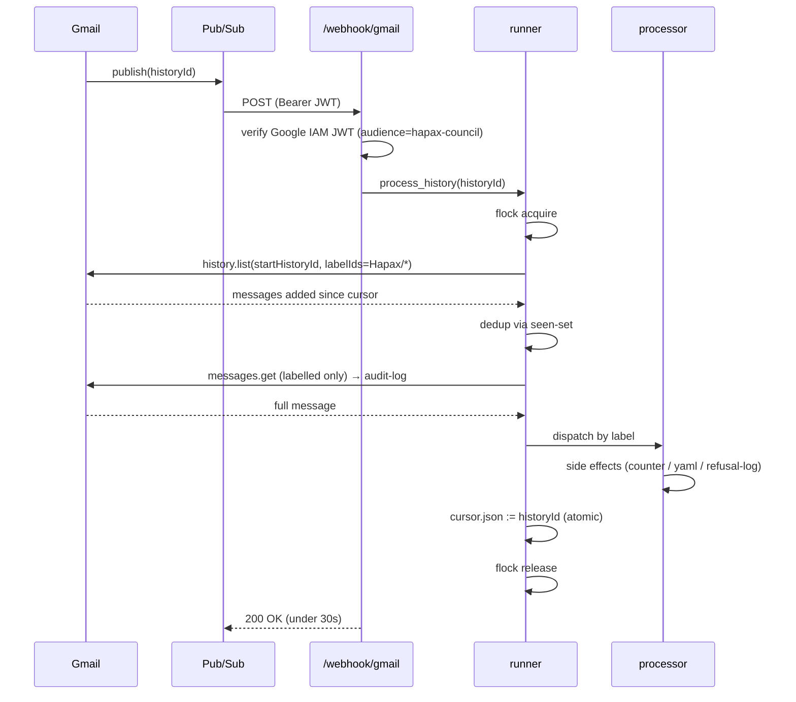
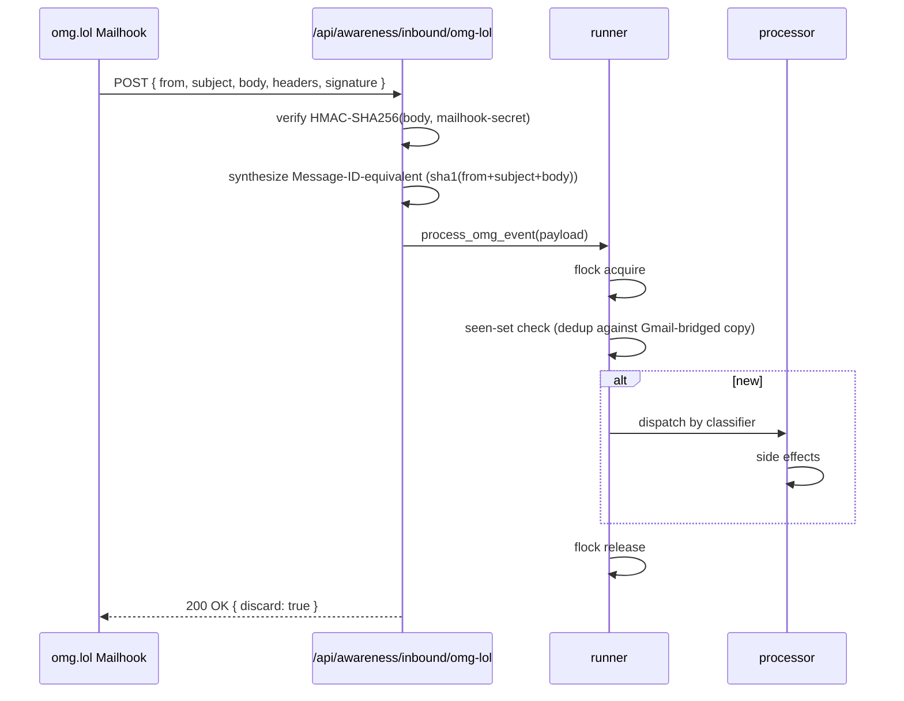
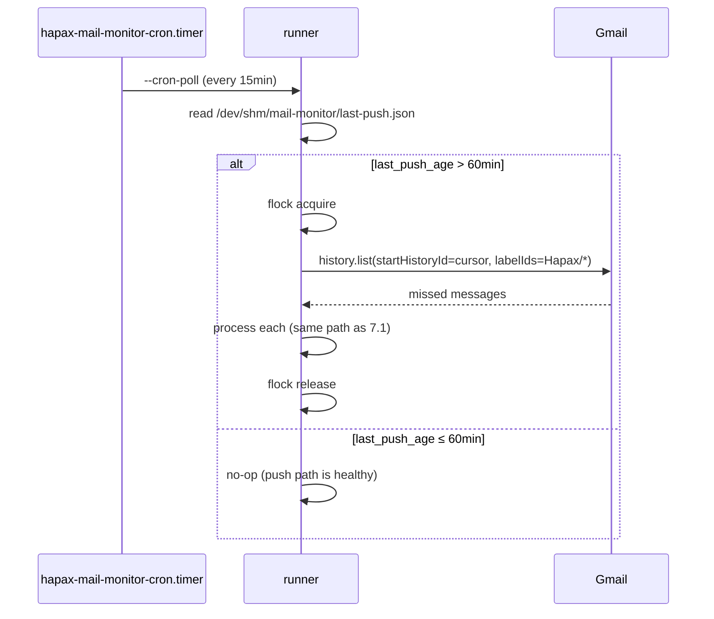

# Mail-monitor design spec

This spec is the load-bearing artefact for `mail-monitor-002` through
`-012`. It fixes the daemon architecture, label taxonomy, six-purpose
flow, auto-click gate, privacy / scope-control mechanism, redaction
policy, sequence diagrams, and HTTP API contract. Every downstream task
references this document.

The drop is, for full-automation purposes, **plumbing**. The daemon
does not surface mail content to the operator. It does not summarise.
It does not score sentiment. It produces awareness counters, a
refusal-feedback log tail, and category-specific side effects. Anything
outside that list is REFUSED — see §10.

## 1. Architecture

Single daemon `agents/mail_monitor/runner.py`, systemd user unit
`hapax-mail-monitor.service`, `Type=notify`, `WatchdogSec=60s`,
`Restart=always`.

**Two ingress paths** in parallel:

- **Push (primary):** Google Cloud Pub/Sub topic
  `projects/<project>/topics/hapax-mail-monitor` with a push subscription
  pointed at `https://logos.tail<…>.ts.net:8051/webhook/gmail`. A
  `users.watch()` call (renewed daily) instructs Gmail to publish events
  for messages with `labelIds=[Hapax/*]` and
  `labelFilterAction=INCLUDE`. The webhook handler validates the Google
  IAM JWT and passes the `historyId` to
  `mail_monitor.runner.process_history()`.
- **Mailhook (omg.lol, parallel for first 30 days):** omg.lol Mailhooks
  POST to `https://logos.tail<…>.ts.net:8051/api/awareness/inbound/omg-lol`
  with HMAC-SHA256-signed payloads. Discard-after-POST is set, so omg.lol
  retains nothing.

**Cron fallback:** every 15 minutes, the daemon checks
`/dev/shm/mail-monitor/last-push.json`; if no push has arrived in 60
minutes, it polls `users.history.list(startHistoryId=cursor)` once.
Covers Pub/Sub regional outages without manufacturing constant API load.

**State:**

- Cursor: `~/.cache/mail-monitor/cursor.json` (`{"history_id": str,
  "last_push_at": iso8601}`), atomic tmp+rename.
- Dedup: SHA-1 of `Message-ID` written to a rocksdb-backed seen-set
  with 90-day TTL. Both Mailhook + Gmail paths consult the same
  seen-set so the parallel-30-day overlap dedups trivially.
- Concurrency: `flock(/run/user/$UID/mail-monitor.lock)` — single
  execution at a time across both ingress paths.
- Audit log: `~/.cache/mail-monitor/api-calls.jsonl` (see §6).

**Daily renewal:** `hapax-mail-monitor-watch-renewal.timer` calls
`users.watch()` every 23 hours (Gmail's max watch lifetime is 7 days,
but Google recommends ≥ daily renewal). Idempotent.

## 2. Label taxonomy

Four labels installed at first daemon boot via
`users.settings.filters.create` + `users.settings.labels.create`:

| Label | Purpose | Server-side filter (`q:`) | Apply | Remove |
|---|---|---|---|---|
| `Hapax/Verify` | DOI/ORCID/OSF/DataCite confirmations | `from:(noreply@zenodo.org OR DoNotReply@notify.orcid.org OR noreply@osf.io OR support@datacite.org)` | `Hapax/Verify` | `INBOX` |
| `Hapax/Suppress` | Cold-contact opt-out — `SUPPRESS` keyword in subject | `subject:SUPPRESS AND (to:hapax@omg.lol OR to:oudepode@omg.lol)` | `Hapax/Suppress` | (none) |
| `Hapax/Operational` | TLS / DNS / GitHub / Porkbun / Let's Encrypt notices | `from:(noreply@letsencrypt.org OR noreply@github.com OR support@porkbun.com)` | `Hapax/Operational` | (none) |
| `Hapax/Discard` | Marketing / list-unsubscribe / social-platform noise | `from:(@linkedin.com OR @twitter.com OR @x.com OR @mastodon.social) OR has:list-unsubscribe` | `Hapax/Discard` | `INBOX` |

Filters are installed idempotently — `mail-monitor-004` enumerates
existing filters via `users.settings.filters.list`, computes the
diff, creates only missing ones. Removal of a Hapax filter is treated
as operator intent and never auto-restored.

The OAuth scope is `https://www.googleapis.com/auth/gmail.modify`.
Filter / label creation requires `gmail.modify` (read-only is
insufficient).

## 3. Six-purpose flow (A–F)

Categories are decided by the classifier (`mail-monitor-007`) using
label as primary signal, plus header / body checks for ambiguous
overlaps. Per-purpose dispatch lives in
`agents/mail_monitor/processors/`.

### A. Accept — verify-link auto-click

- **Trigger:** sender ∈ `ALLOW_SENDERS` AND outbound-correlation hit
  (a record exists in `~/.cache/mail-monitor/pending-actions.jsonl`
  within ±10 minutes from the same sender domain).
- **Processor:** `auto_clicker.py` — applies the 5-condition gate (§4).
- **Surface:** AUTO if all conditions; **silently discard** otherwise.
  Never escalate to operator-surface — failed auto-click is itself a
  no-op, logged but not announced.

### B. Verify — DOI / ORCID / OSF / DataCite extraction

- **Trigger:** `Hapax/Verify` label.
- **Processor:** `processors/verify.py` — regex-extract DOI from body
  (`10\.\d{4,9}/[-._;()/:A-Z0-9]+` case-insensitive, anchored to
  `https://doi.org/` prefix), write to `.zenodo.json`'s
  `version_doi` field, emit `awareness.mail.verify_event` with
  `{kind: "doi", value: <doi>, ts: <iso>}`.
- **Surface:** AUTO. Never surface unless extraction fails — a failed
  extraction emits a refusal-brief entry tagged
  `mail-monitor:verify-extract-fail` so the operator can audit but is
  not paged.

### C. Suppress — cold-contact opt-out

- **Trigger:** body contains `SUPPRESS` line-anchored (`^SUPPRESS$`
  or `^SUPPRESS\s`) AND the message is a reply to a Hapax-originated
  thread (`In-Reply-To` or `References` header lists a Message-ID
  the daemon previously sent).
- **Processor:** `processors/suppress.py` — append the sender's address
  + a deterministic hash of the request to
  `hapax-state/contact-suppression-list.yaml`. Emit a refusal-brief
  log entry with `axiom: interpersonal_transparency`,
  `surface: mail-monitor:suppress`,
  `reason: "<sender> opted out of cold contact via SUPPRESS reply"`.
- **Surface:** counter increments `awareness.mail.suppress_count_1h`
  → waybar `custom/refusals-1h`. No mail content surfaces.

### D. Operational — TLS / DNS / dependabot

- **Trigger:** `Hapax/Operational` label, plus per-sender body parse
  (Let's Encrypt expiry-N-days, GitHub PR notification, Porkbun DNS
  change confirmation).
- **Processor:** `processors/operational.py` — route to the
  category-specific awareness slot:
  `awareness.mail.operational_alerts.tls_expiring`,
  `…operational_alerts.gh_pr_open_count`,
  `…operational_alerts.dns_change_pending`.
- **Surface:** auto-surface to the orientation panel "operational"
  domain. **Never auto-action** — TLS expiry-soon does not trigger
  cert renewal from this path; that is the existing
  `hapax-cert-renew.timer`'s job.

### E. Refusal-feedback — replies that are NOT SUPPRESS

- **Trigger:** reply-to-Hapax-thread (same `In-Reply-To` /
  `References` test as C) AND `Hapax/Suppress` label NOT present AND
  `Hapax/Verify` label NOT present.
- **Processor:** `processors/refusal_feedback.py` — append a refusal-
  brief log entry with `kind: "feedback"`, `sender_hash: <sha1>`,
  `subject_hash: <sha1>`, `body_excerpt: null`. **No body content**
  enters the log. No sentiment scoring.
- **Surface:** `awareness.mail.refusal_feedback_unread` counter →
  refusal-brief sidebar shows N unread entries with
  `[hash, ts, "(content withheld)"]`. The operator can view full
  body in Gmail directly.

### F. Anti-pattern — marketing / social platforms

- **Trigger:** `Hapax/Discard` label.
- **Processor:** `processors/discard.py` — `messages.modify` to
  `removeLabelIds=[INBOX]` (filter D already does this; the
  processor is the post-modify hook for the seen-set + audit log).
- **Surface:** none. Counter `awareness.mail.discard_count_24h`
  exists for diagnostic but is not surfaced anywhere.

## 4. Five-condition auto-click gate

**ALL** five conditions must be true for `auto_clicker.py` to issue
an HTTP GET on the verify link. Failure of ANY condition → silent
discard + awareness event `awareness.mail.auto_click_skipped` with
the failed-condition index. Never escalates to operator-surface.

1. **DKIM/SPF/DMARC pass:** `Authentication-Results` header parsed via
   `email.utils.parseaddr`-style + manual key/value extraction; all
   three of `dkim=pass`, `spf=pass`, `dmarc=pass` must be present
   for the SMTP envelope-from domain.
2. **Sender allowlist:** SMTP envelope-from ∈ `ALLOW_SENDERS` (config:
   `agents/mail_monitor/config.py`, list of domain literals; loaded
   from `pass` if any addresses are operator-private).
3. **URL allowlist:** the link's host ∈ `ALLOW_LINK_DOMAINS` after
   following at most 1 HTTP redirect (resolved via `requests.head` with
   `allow_redirects=False`, then a second probe of the
   `Location` header). Scheme MUST be `https`. No subdomain
   wildcards; exact host match.
4. **Outbound correlation:** a matching record in
   `~/.cache/mail-monitor/pending-actions.jsonl` within ±10 minutes
   of the message receipt time. Matching by sender-domain + action
   tag. The pending-actions file is written by Hapax-side daemons that
   triggered the verify (Zenodo deposit, OSF connect, ORCID consent).
5. **Working mode + opt-in:** operator working-mode is `rnd` OR the
   correlated pending-action has `auto_unattended=true`. (Research
   working-mode requires explicit opt-in per pending-action; rnd
   defaults open.)

## 5. Privacy / scope-control mechanism

`gmail.modify` is mailbox-wide; cryptographic proof of "Hapax-only" is
not possible at the OAuth scope layer. The spec compensates with five
complementary mechanisms. Each addresses a different failure mode.

### 5.1 Server-side filter installs at bootstrap

`users.settings.filters.create` writes the four filters in §2. Hapax
labels populate automatically as mail arrives; no Hapax-side
classification is needed for triage.

**Failure mode:** filter create fails on first boot (network, scope,
quota). Mitigation: daemon refuses to start until filters are
verified present (idempotent retry with exponential backoff up to
1 hour; emit awareness event `mail.bootstrap_pending` if still
failing past 1 hour).

### 5.2 `users.watch()` with `INCLUDE` label filter

`watch()` is called with
`labelIds=[Hapax/Verify, Hapax/Suppress, Hapax/Operational, Hapax/Discard]`,
`labelFilterAction=INCLUDE`. Pub/Sub events arrive only for messages
labeled with one of those four. Non-Hapax mail does not enter the
push path at all.

**Failure mode:** `watch()` is called without filter (regression /
typo). Mitigation: integration test (`tests/mail_monitor/
test_watch_call_filter.py`) mocks the Gmail API and asserts the
`Request.body` includes `labelIds` and `labelFilterAction=INCLUDE`.
CI gate.

### 5.3 Static check + integration test on `messages.list`

Daemon code never calls `messages.list` without
`q:label:Hapax/*`. Enforced by:

- **Static check:** `scripts/check-mail-monitor-no-bare-list.py`
  greps `agents/mail_monitor/` for `messages\(\).list` calls and
  asserts each one has a `q=` kwarg referring to a Hapax label.
  CI lint job.
- **Integration test:** `tests/mail_monitor/test_no_bare_list.py`
  installs a mock Gmail API client that records every list call;
  exercises the daemon's full message-loop and asserts every
  `messages.list` invocation has a Hapax-label-bearing query.

### 5.4 Audit log

Every `messages.get` call appends a JSONL line to
`~/.cache/mail-monitor/api-calls.jsonl`:

```json
{"ts": "<iso8601>", "method": "messages.get", "messageId": "<id>",
 "label": "<Hapax/*>", "scope": "gmail.modify"}
```

Operator can `cat` it any time. A weekly digest job tails the log and
emits a refusal-brief entry if any `messages.get` is observed without
a Hapax label (defense in depth — should never fire if 5.3 holds, but
the audit confirms).

### 5.5 Operator revocation drill

Google Account → Security → Third-party access → revoke disables all
reads immediately. The daemon detects 401 on next API call and
enters `DEGRADED` state (emits `awareness.mail.degraded=true` and
exits the runner loop; systemd restarts but the OAuth token is
permanently invalid until re-mint).

`tests/mail_monitor/test_revocation_drill.py` asserts that on a
mocked 401, the daemon transitions to DEGRADED within 30 s and
publishes the awareness event.

## 6. Redaction policy

The ONLY surfaces that may contain mail-derived content are the audit
log (§5.4) and the refusal-brief log (§3.C / §3.E). Even within those,
only specific fields are allowed.

| Surface | Allowed fields | Forbidden |
|---|---|---|
| `chronicle/` (Hapax narrative log) | NONE — mail content never enters chronicle | All — sender, subject, body, headers, message-IDs |
| `/dev/shm/hapax-awareness/state.json` (`awareness.mail.*`) | counters (int), boolean flags, timestamp ISO strings | sender / subject / body / headers / message-IDs |
| `~/.cache/mail-monitor/api-calls.jsonl` | timestamp, method, messageId (opaque Gmail ID), label, scope | body, subject, sender address (only the messageId is logged; messageId is not a human-readable identifier) |
| `~/hapax-state/refusal-brief/log.jsonl` (Categories C, E) | `axiom`, `surface`, `reason` (templated string with no PII), `sender_hash` (SHA-1), `subject_hash` (SHA-1), `ts` | full sender address, full subject, body, body excerpts |
| `hapax-state/contact-suppression-list.yaml` (Category C) | sender address (canonical, lowercased), opt-out timestamp, request hash (SHA-1 of body to dedupe duplicate suppression requests) | body, subject, full message metadata |
| Operator-facing surfaces (waybar / orientation / refusal sidebar) | counter values + timestamps | All mail-derived content |

The `body_excerpt` field that appears in some refusal-brief
implementations is **explicitly NULL** for mail-monitor entries.
Excerpting body text leaks PII; the operator can read the original
mail in Gmail.

`sender_hash` uses SHA-1 of the canonical lowercased address with a
deterministic per-installation salt at
`pass show mail-monitor/sender-hash-salt`. The salt makes the hashes
useless to anyone outside this installation but stable across daemon
restarts.

## 7. Sequence diagrams

### 7.1 Pub/Sub push (primary path)



### 7.2 omg.lol Mailhook (parallel ingress)



### 7.3 Cron fallback (Pub/Sub down)



## 8. HTTP API contract

Endpoints registered in `logos/api/routes/`. All four use FastAPI +
Pydantic.

### 8.1 `POST /webhook/gmail`

Pub/Sub push subscriber. Validates Google IAM JWT (audience must
match `https://logos.tail<…>.ts.net:8051/webhook/gmail`).

**Request body** (Pub/Sub envelope):

```python
class PubSubMessage(BaseModel):
    data: str  # base64(json({"emailAddress": str, "historyId": str}))
    messageId: str
    publishTime: str  # iso8601
    attributes: dict[str, str] | None = None

class PubSubEnvelope(BaseModel):
    message: PubSubMessage
    subscription: str  # "projects/<proj>/subscriptions/<sub>"
```

**Response:** `200 OK` with empty body within 30 s; otherwise Pub/Sub
retries. Late processing happens asynchronously after the daemon
hands off the historyId.

**Auth:** `Authorization: Bearer <google-iam-jwt>`. Verify via
`google.oauth2.id_token.verify_oauth2_token(jwt, GOOGLE_CERTS,
audience=...)`.

### 8.2 `POST /api/awareness/inbound/omg-lol`

omg.lol Mailhook receiver. HMAC-SHA256-signed body.

**Request body:**

```python
class OmgLolMailhookPayload(BaseModel):
    from_: EmailStr = Field(alias="from")
    subject: str
    body: str
    headers: dict[str, str]  # raw headers as forwarded by omg.lol
    received_at: str  # iso8601
```

**Headers required:**

- `X-Hapax-Mailhook-Signature: <hex(HMAC-SHA256(body, secret))>`
- Body = raw payload bytes; secret from
  `pass show mail-monitor/omg-lol-mailhook-secret`.

**Response:** `200 OK { "discard": true }` (omg.lol uses this to
decide retention).

### 8.3 `GET /api/awareness/mail/categories`

Read aggregated category counts. No auth — local network only,
firewalled.

**Response:**

```python
class MailCategoryCounts(BaseModel):
    suppress_count_1h: int
    operational_alerts: dict[str, int]   # {"tls_expiring": n, ...}
    refusal_feedback_unread: int
    discard_count_24h: int
    last_processed_at: str | None  # iso8601
    daemon_state: Literal["healthy", "degraded", "starting"]
```

### 8.4 `GET /api/awareness/mail/refusal-feedback`

Read refusal-brief mail entries (Categories C, E). Counter-style; no
mail content.

**Response:**

```python
class RefusalFeedbackEntry(BaseModel):
    ts: str
    kind: Literal["feedback", "suppress"]
    sender_hash: str  # sha1(canonical_lowercased + salt)
    subject_hash: str
    axiom: str = "interpersonal_transparency"

class RefusalFeedbackList(BaseModel):
    entries: list[RefusalFeedbackEntry]
    unread_count: int
    last_read_at: str | None  # iso8601, persisted in /dev/shm
```

## 9. Implementation file layout

```
agents/mail_monitor/
├── __init__.py
├── __main__.py                      # python -m agents.mail_monitor
├── runner.py                        # main loop + flock + dispatch
├── oauth.py                         # first-consent CLI + refresh
├── filter_bootstrap.py              # idempotent filter create
├── label_bootstrap.py               # idempotent label create
├── webhook.py                       # JWT/HMAC verify helpers
├── classifier.py                    # rule-based + LLM-fallback
├── auto_clicker.py                  # 5-condition gate (§4)
├── correlations.py                  # pending-actions.jsonl read
├── processors/
│   ├── __init__.py
│   ├── verify.py                    # Category B
│   ├── suppress.py                  # Category C
│   ├── operational.py               # Category D
│   ├── refusal_feedback.py          # Category E
│   └── discard.py                   # Category F
├── audit.py                         # api-calls.jsonl writer + weekly digest
├── config.py                        # ALLOW_SENDERS / ALLOW_LINK_DOMAINS / paths
└── state.py                         # cursor + seen-set + last-push tracking

logos/api/routes/
├── webhook_gmail.py
├── webhook_omg.py
└── awareness_mail.py                # GET endpoints

systemd/units/
├── hapax-mail-monitor.service
└── hapax-mail-monitor-watch-renewal.timer

shared/
└── omg_lol_client.py                # extend with set_mailhook(), get_mailhook()

hapax-state/
├── contact-suppression-list.yaml    # Category C output
└── refusal-brief/log.jsonl          # Category E output (existing)

scripts/
└── check-mail-monitor-no-bare-list.py  # CI lint (§5.3)

tests/mail_monitor/
├── test_oauth.py
├── test_filter_bootstrap.py
├── test_label_bootstrap.py
├── test_classifier.py
├── test_auto_clicker.py
├── test_no_bare_list.py             # §5.3 integration
├── test_watch_call_filter.py        # §5.2 integration
├── test_revocation_drill.py         # §5.5 integration
├── test_redaction.py                # §6 — no body content leaks
└── processors/
    ├── test_verify.py
    ├── test_suppress.py
    ├── test_operational.py
    ├── test_refusal_feedback.py
    └── test_discard.py
```

## 10. Anti-patterns (REFUSED candidates)

These are first-class refusal entries — see
`cc-tasks/active/mail-monitor-refused-*`. Each is a constitutional
violation, not merely an out-of-scope feature.

1. **Hapax Inbox panel (`mail-monitor-refused-inbox-panel`)** — A
   visible inbox panel manufactures HITL pressure ("you have 4
   unread"). Counters are atomic — they do not aggregate across
   categories or invite triage.
2. **Sentiment analysis on operator's correspondence
   (`mail-monitor-refused-sentiment-scoring`)** — Privacy violation;
   no scoring, coloring, or summarisation of raw correspondence
   beyond the strict redaction policy in §6.
3. **Auto-reply (`mail-monitor-refused-auto-reply`)** — Except the
   outbound-correlated DOI-failed-retrying narrow case with the
   strict allowlist, the daemon never composes outbound mail.
4. **Spam-classifier-loses-refusal
   (`mail-monitor-refused-spam-classifier-discards-feedback`)** —
   False-negative on refusal-feedback (Category E mis-tagged as
   Category F) is a constitutional violation. The classifier (§7)
   prefers false-positive on E (over-tag) over false-negative.
5. **Weekly mail digest (`mail-monitor-refused-weekly-digest`)** —
   Aggregation obscures refusal-as-data; counters are atomic, not
   aggregated. The audit-log weekly-digest in §5.4 is the only
   permitted aggregation, and it is for the operator's privacy
   recourse, not a content surface.
6. **Reading mail outside Hapax/* labels
   (`mail-monitor-refused-out-of-label-read`)** — Privacy substrate.
   §5.2 + §5.3 are the load-bearing checks; this refusal is
   structural.
7. **Webhook without JWT / HMAC verification
   (`mail-monitor-refused-unverified-webhook`)** — Sender-spoofing
   trivial; the JWT and HMAC checks are not optional.

## 11. Cross-links

- **`mail-monitor-008-suppress-processor`** BLOCKS
  `cold-contact-suppression-list` — SUPPRESS detection (Category C)
  is the load-bearing mail-side input that populates the
  cold-contact suppression list. Without §3.C, cold-contact daemons
  cannot honor opt-outs.
- **`mail-monitor-009-verify-processor`** is a redundant correctness
  signal for `pub-bus-zenodo-graph` — Zenodo's verify-DOI emails
  confirm successful mints. The deposit-builder reads
  `manifest.zenodo.version_doi` from API response primarily; the
  verify-mail path corroborates and surfaces failures the API alone
  may miss.
- **`mail-monitor-006-webhook-receivers`** depends on
  `awareness-api-rest-endpoint` — the route registry must exist
  before mail-monitor adds `/webhook/gmail` and
  `/api/awareness/inbound/omg-lol`.
- **`mail-monitor-010-auto-clicker-with-correlation`** depends on
  the `pending-actions.jsonl` writer, which is part of each Hapax-
  side daemon that triggers a verify (Zenodo deposit, OSF connect,
  ORCID consent). Each callsite must be updated when its workstream
  ships.

## Bootstrap (one-time operator-physical)

OAuth requires a human at the consent screen — Google does not expose
an API path that bypasses it. This is the only operator-physical step
in the mail-monitor family. After bootstrap completes, every other
operation is daemon-side and the refresh token is valid until revoked.

### Console steps

1. Open <https://console.cloud.google.com/projectcreate>. Create a new
   project (or reuse `hapax-personal`); set the **billing account** to
   *No organization* and the **project name** to a recognizable
   string.
2. **APIs & Services → Library** → enable **Gmail API** and
   **Cloud Pub/Sub API**.
3. **APIs & Services → OAuth consent screen** →
   - User type: **External** (required for personal Google accounts).
   - App name: `hapax-mail-monitor` (operator-facing only).
   - User support email + developer contact email: operator's address.
   - Scopes: leave the consent-screen scope list empty; the daemon
     will request `gmail.modify` at runtime.
   - Test users: add the operator's Gmail address. The app stays in
     **Testing** mode — no Google verification process is required for
     a single-user testing app.
4. **APIs & Services → Credentials** → **Create Credentials → OAuth
   client ID** →
   - Application type: **Desktop app**.
   - Name: `hapax-mail-monitor desktop client`.
   - Download the resulting `client_secret_*.json`.

### Pass-store + first-consent

```bash
# Insert the OAuth client id + secret. Both values come from the
# downloaded JSON's `installed.client_id` / `installed.client_secret`
# fields — copy them out individually, do NOT paste the whole JSON.
pass insert mail-monitor/google-client-id
pass insert mail-monitor/google-client-secret

# Run the first-consent flow. A browser window opens at the Google
# consent screen — approve the gmail.modify scope. The refresh token
# Google returns is persisted to pass mail-monitor/google-refresh-token.
uv run python -m agents.mail_monitor.oauth --first-consent

# Verify the bootstrap. Loads the cached refresh token, exchanges it
# for a fresh access token, and calls users.getProfile. Should print
# the operator's email + total message count.
uv run python -m agents.mail_monitor.oauth --verify
```

If `--verify` fails, check:

- All three `pass show mail-monitor/google-*` keys return non-empty
  values.
- The OAuth consent screen still has the operator's address listed
  under **Test users**.
- The refresh token has not been revoked at
  <https://myaccount.google.com/connections>.

### Revocation drill (smoke test)

The operator can revoke the daemon's access at any time via Google
Account → Security → **Third-party access** → revoke for the
`hapax-mail-monitor` client. The next ``messages.modify`` /
``users.watch()`` call returns HTTP 401; ``load_credentials`` returns
``None`` and increments
``hapax_mail_monitor_oauth_refresh_total{result="revoked"}``. The
daemon emits ``awareness.mail.degraded=true`` and exits the runner
loop. systemd restarts the unit; the next startup observes the same
failure and exits again. The operator must re-run ``--first-consent``
to mint a fresh refresh token.

## 12. Out of scope (deliberate)

- Multi-account / multi-user Gmail support. `single_user` axiom:
  one operator, one Gmail.
- Workspace (`@your-domain.com`) Gmail. `gmail.modify` works for
  Workspace too, but Domain-Wide Delegation paths and admin
  policies are not in scope; this design targets personal Gmail.
- Outbound mail composition (except the narrow auto-click in §3.A,
  which is a GET to a verify URL, not an outbound message).
- Any UI surface for mail content. Counters only.

## Source research

- `docs/research/2026-04-25-mail-monitoring.md` — research drop
- Constitutional binders: `single_user` (§12), `interpersonal_transparency`
  (§3.C, §3.E, §6), `executive_function` (auto-resolution of
  Categories A, B, F)
