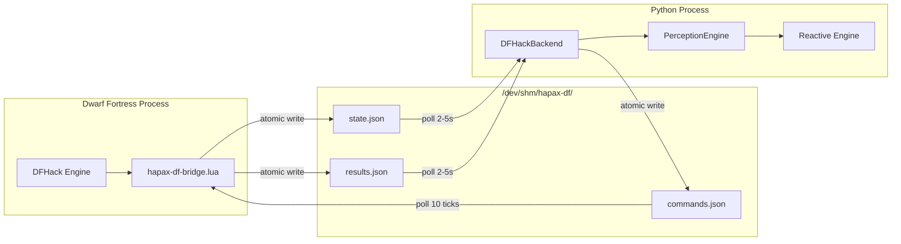

# DFHack Bridge Protocol — Design Spec

> **Status:** Design (architectural specification)
> **Date:** 2026-03-23
> **Scope:** `agents/hapax_daimonion/backends/`, DFHack Lua scripts — bidirectional bridge between Dwarf Fortress and the perception engine
> **Builds on:** [Perception Primitives Design](2026-03-11-perception-primitives-design.md), [Multi-Role Composition Design](2026-03-12-multi-role-composition-design.md)

## Problem

Dwarf Fortress exposes game state through DFHack's Lua scripting environment, but no structured mechanism exists to ingest that state into the perception engine or to issue commands back to the game. A bridge is required that satisfies three constraints:

1. **Zero external dependencies.** No protobuf compilation, no network sockets, no IPC libraries. The existing `/dev/shm` file-polling pattern used by `perception-state.json`, `stimmung-state.json`, and `visual-layer-state.json` is sufficient and proven.
2. **Bidirectional communication.** The perception engine must read fortress state (world → agent) and issue commands (agent → world).
3. **Graceful degradation.** When Dwarf Fortress is not running, the backend produces no data and consumes no resources. No component fails or blocks.

This spec defines the data flow, file formats, Lua script behavior, and Python backend interface for the bridge.

---

## Section 1: Architecture Overview

The bridge consists of two independent processes communicating through three JSON files in `/dev/shm/hapax-df/`:

| File | Writer | Reader | Semantics |
|------|--------|--------|-----------|
| `state.json` | Lua script | Python backend | Current fortress state |
| `commands.json` | Python backend | Lua script | Pending action requests |
| `results.json` | Lua script | Python backend | Command execution outcomes |

All file writes use atomic write-then-rename: the writer serializes to a `.tmp` file in the same directory, then calls `os.rename()` (Lua) or `os.replace()` (Python) to move it to the final path. This guarantees readers never observe a partial write.

The Python backend polls `state.json` on a 2–5 second wall-clock interval (SLOW tier). The Lua script polls `commands.json` on a 10-tick game interval. No persistent connection exists between the two processes.



---

## Section 2: Lua Script (`hapax-df-bridge.lua`)

### 2.1 Execution Model

The script registers three categories of callbacks within DFHack:

1. **Periodic state export** via `repeat-util.scheduleEvery()`. Two cadences:
   - Fast state: every 120 ticks (1 in-game day).
   - Full state: every 1200 ticks (1 in-game season).
2. **Periodic command poll** via `repeat-util.scheduleEvery()`: every 10 ticks.
3. **Immediate event hooks** via `eventful.onUnitDeath`, `eventful.onInvasion`, `eventful.onSyndrome`, `eventful.onUnitNewActive`. These fire synchronously within the game tick that triggers them.

### 2.2 State Export — Fast State (every 120 ticks)

The fast state captures operational vitals. Fields:

| Field | Type | Source |
|-------|------|--------|
| `unit_count` | `int` | `#df.global.world.units.active` |
| `food_count` | `int` | Edible item count from `df.global.world.items.all` |
| `drink_count` | `int` | Drinkable item count from `df.global.world.items.all` |
| `active_threats` | `int` | Hostile unit count (unit flags check) |
| `job_queue_length` | `int` | `#df.global.world.jobs.list` |
| `date` | `object` | `{year, season, month, day}` derived from `df.global.cur_year`, `df.global.cur_year_tick` |
| `paused` | `bool` | `df.global.pause_state` |
| `fortress_name` | `string` | `dfhack.TranslateName(df.global.world.world_data.active_site[0].name)` |
| `events` | `list` | Accumulated event buffer (flushed on export) |
| `tick` | `int` | `df.global.cur_year_tick` |
| `export_type` | `string` | `"fast"` or `"full"` |

### 2.3 State Export — Full State (every 1200 ticks)

The full state includes all fast state fields plus detailed breakdowns:

| Field | Type | Description |
|-------|------|-------------|
| `units` | `list[object]` | Each unit: `{id, name, profession, skills, stress, mood, squad_id}` |
| `stockpiles` | `object` | 80+ item categories with counts, keyed by category name |
| `buildings` | `list[object]` | Building type, position, condition |
| `military` | `list[object]` | Squad name, member count, station assignment, alert level |
| `workshop_orders` | `list[object]` | Active manager orders with progress |
| `map_summary` | `object` | `{explored_pct, cavern_breached, water_sources, z_levels}` |
| `wealth` | `object` | `{created, imported, exported, total}` from `df.global.ui.tasks` |

### 2.4 Event Buffer

Eventful callbacks append event records to an in-memory list. Each record contains:

```lua
{
    type = "INVASION" | "UNIT_DEATH" | "SYNDROME" | "UNIT_NEW_ACTIVE",
    tick = df.global.cur_year_tick,
    data = {}  -- event-type-specific fields
}
```

The buffer is flushed (copied and cleared) on every fast state export. Events that occur between exports are not lost; they accumulate until the next export cycle.

### 2.5 Serialization

All JSON serialization uses the DFHack `json` module (`local json = require('json')`). The atomic write sequence:

```lua
local tmp_path = path .. ".tmp"
local f = io.open(tmp_path, "w")
f:write(json.encode(data))
f:close()
os.rename(tmp_path, path)
```

---

## Section 3: Command Protocol

### 3.1 Format

Commands are a JSON array of action objects. Each object has an `id` field (string, caller-assigned) and an `action` field (string, one of the defined action types). Remaining fields are action-specific.

```json
[
    {"id": "cmd-001", "action": "pause", "state": true},
    {"id": "cmd-002", "action": "dig", "csv": "d(5x5)"}
]
```

### 3.2 Processing

The Lua script reads `commands.json`, iterates the array, executes each action, records results, and deletes the commands file. Deletion is the acknowledgment — if the file exists, it has not been processed. This guarantees exactly-once semantics under the constraint that only one writer (Python) and one reader (Lua) exist.

### 3.3 Action Types

| Action | Parameters | Implementation |
|--------|-----------|----------------|
| `dig` | `csv: string` | `quickfort.apply_blueprint_string(csv, "dig")` |
| `build` | `csv: string` | `quickfort.apply_blueprint_string(csv, "build")` |
| `place` | `csv: string` | `quickfort.apply_blueprint_string(csv, "place")` |
| `order` | `item_type: string, material: string, quantity: int` | Manager order via `df.global.world.manager_orders` |
| `military` | `op: string, squad_id: int, ...` | Squad operations: `create`, `assign`, `station`, `kill_order` |
| `labor` | `unit_id: int, labor: string, enabled: bool` | `df.global.world.units.active[unit_id].status.labors[labor] = enabled` |
| `pause` | `state: bool` | `df.global.pause_state = state` |
| `save` | (none) | `dfhack.run_command("quicksave")` |
| `raw` | `command: string` | `dfhack.run_command(command)` — escape hatch for arbitrary DFHack commands |

### 3.4 Results

After processing each command, the Lua script writes a result record to `/dev/shm/hapax-df/results.json`. The results file is a JSON object keyed by command `id`:

```json
{
    "cmd-001": {"status": "ok"},
    "cmd-002": {"status": "error", "message": "Invalid blueprint syntax at line 1"}
}
```

Failed commands log an error message but do not halt processing of subsequent commands in the same batch.

---

## Section 4: Python Backend (`backends/dfhack.py`)

### 4.1 Backend Interface

`DFHackBackend` extends the PerceptionEngine backend pattern. It registers as a SLOW-tier source with a 2–5 second poll interval.

### 4.2 Published Behaviors

| Behavior | Type | Derivation |
|----------|------|------------|
| `fortress_population` | `Behavior[int]` | `state.unit_count` |
| `fortress_food` | `Behavior[int]` | `state.food_count` |
| `fortress_drink` | `Behavior[int]` | `state.drink_count` |
| `fortress_threats` | `Behavior[int]` | `state.active_threats` |
| `fortress_mood_avg` | `Behavior[float]` | Mean of `unit.stress` across all units (full state only) |
| `fortress_date` | `Behavior[FortressDate]` | `state.date` |
| `fortress_wealth` | `Behavior[int]` | `state.wealth.total` (full state only) |
| `fortress_military_readiness` | `Behavior[float]` | Ratio of armed/assigned units to total military (full state only) |

Behaviors derived from full state fields retain their last known value between full state exports. The `Watermark` on these behaviors reflects the timestamp of the most recent full export.

### 4.3 Published Events

| Event | Trigger |
|-------|---------|
| `fortress_siege` | Event buffer entry with `type == "INVASION"` |
| `fortress_migrant_wave` | Event buffer entry with `type == "UNIT_NEW_ACTIVE"` and unit count delta > 3 |
| `fortress_death` | Event buffer entry with `type == "UNIT_DEATH"` |
| `fortress_mood_break` | Event buffer entry with `type == "SYNDROME"` where syndrome is a mood-related tantrum spiral |
| `fortress_season_change` | `state.date.season` differs from previous sample |

### 4.4 Command Interface

```python
def send_command(self, action: dict) -> str:
    """Write a command to commands.json. Returns the assigned command ID.

    Uses atomic write (write to .tmp, os.replace to final path).
    If commands.json already exists (previous batch not yet consumed),
    the new command is appended to the existing array.
    """

def poll_results(self) -> dict[str, dict]:
    """Read and clear results.json. Returns mapping of command ID to result.

    If no results file exists, returns empty dict.
    """
```

---

## Section 5: Installation and Lifecycle

### 5.1 Lua Script Installation

The Lua script is placed at `<DF_INSTALL>/hack/scripts/hapax-df-bridge.lua`. It follows the standard DFHack script conventions: callable from the DFHack console or `dfhack.init`.

```
hapax-df-bridge start    -- begin state export and command polling
hapax-df-bridge stop     -- cancel all repeat-util schedules, remove eventful hooks
hapax-df-bridge status   -- print current state (running/stopped, tick counts, file paths)
```

### 5.2 Python Backend Configuration

The backend is configured in the agent config alongside other perception backends. When the backend is enabled but Dwarf Fortress is not running, it returns empty state and publishes no events.

### 5.3 Health Check

State freshness determines liveness. If `state.json` has a filesystem modification time older than 30 seconds, the backend reports the source as inactive. Causes of staleness include: DF not running, DF paused (no ticks advancing), or the Lua script stopped.

The 30-second threshold accounts for the maximum fast-state export interval (120 ticks at normal game speed is approximately 2 seconds) with margin for game slowdown under load.

---

## Section 6: Relation to Existing Architecture

### 6.1 Pattern Reuse

The bridge replicates the established `/dev/shm` polling pattern used by three existing data flows:

| Existing source | File | Writer | Reader |
|----------------|------|--------|--------|
| Perception state | `/dev/shm/hapax/perception-state.json` | Voice daemon | Logos API |
| Stimmung state | `/dev/shm/hapax/stimmung-state.json` | Visual layer aggregator | Logos API |
| Visual layer state | `/dev/shm/hapax/visual-layer-state.json` | Studio compositor | Logos API |

The DFHack bridge adds a fourth source at `/dev/shm/hapax-df/state.json` using identical semantics: atomic JSON writes, filesystem polling, staleness-based health checks.

### 6.2 Integration Points

- **PerceptionRing:** `FortressState` becomes a new input alongside existing biometric, visual, and environmental signals. Temporal band assignment follows from the poll cadence (SLOW tier, 2–5s).
- **ContentScheduler:** Fortress behaviors are eligible for ground surface display, subject to the same salience and scheduling logic as other content sources.
- **Reactive engine:** Fortress events (siege, death, mood break) feed into Phase 0 deterministic rules. No new rule infrastructure is required — events are typed identically to existing perception events.

### 6.3 No New Infrastructure

The bridge introduces no new dependencies, services, containers, or communication patterns. It reuses: `/dev/shm` shared memory filesystem, JSON serialization, atomic file rename, poll-based ingestion, `Behavior[T]` and `Event[T]` primitives.

---

## Section 7: Security and Isolation

### 7.1 Filesystem Permissions

The Lua script creates `/dev/shm/hapax-df/` with mode `0700` (owner read/write/execute only). Since both the DFHack process and the Python backend run under the same user account, this is sufficient. No other users on the system can read fortress state or inject commands.

### 7.2 Command Replay Prevention

The Lua script deletes `commands.json` after processing. A command file is consumed exactly once. There is no mechanism for a command to be re-executed after deletion. If the Python backend writes a new `commands.json` before the previous one is consumed, the new file overwrites the old one — the `send_command` method handles this by reading, appending, and rewriting atomically.

### 7.3 Network Isolation

No component of the bridge uses network sockets. All communication is through the local filesystem. DFHack's own remote RPC interface (`RemoteServer`) is orthogonal to this bridge and remains in whatever state the user has configured (disabled by default).

### 7.4 Trust Boundary

The `raw` command action accepts arbitrary DFHack command strings. This is an intentional escape hatch. The trust model assumes the Python backend is operated by the same user who runs Dwarf Fortress. No command validation beyond DFHack's own error handling is applied.
