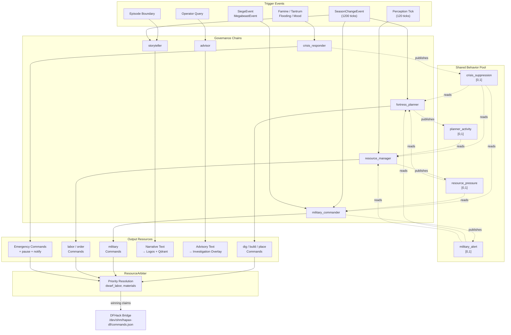

# Fortress Governance Chains — Design Spec

> **Status:** Design (governance architecture specification)
> **Date:** 2026-03-23
> **Scope:** `agents/fortress/` — concurrent governance chains for autonomous fortress management
> **Builds on:** [Multi-Role Composition Design](2026-03-12-multi-role-composition-design.md), [Multi-Role North Star](2026-03-12-multi-role-north-star-design.md), [Fortress State Schema](2026-03-23-fortress-state-schema.md), [DFHack Bridge Protocol](2026-03-23-dfhack-bridge-protocol.md), [Blueprint Library Spec](2026-03-23-blueprint-library-spec.md)

## Problem

Fortress management decomposes into six concurrent responsibilities: spatial planning, military command, resource allocation, narrative generation, advisory response, and crisis intervention. Each responsibility has a distinct trigger domain, cadence, and output resource set. Without formal governance chains, these responsibilities either serialize (losing real-time responsiveness) or execute independently (producing conflicting commands for shared resources such as dwarf labor and material stockpiles).

The multi-role composition architecture provides the structural primitives: Behavior, Event, Combinator, VetoChain, FallbackChain, SuppressionField, ResourceArbiter, Command, and Schedule. This spec maps those primitives to the fortress domain, defining six governance chains that compose concurrently with explicit cross-chain coordination.

---

## Section 1: Role-to-Chain Mapping

Six governance chains operate concurrently. Each is an independent composition of existing perception and governance primitives.

| Chain | Studio Analog | Trigger Domain | Cadence | Output Resources |
|-------|--------------|----------------|---------|-----------------|
| `fortress_planner` | Stream director | Season boundary Event | 1/season (1200 ticks) | `dig`, `build`, `place` Commands |
| `military_commander` | MC | Threat Event + season tick | Event-driven + 1/season | `military` Commands (squad, kill order, burrow) |
| `resource_manager` | Production assistant | Perception tick | 1/day (120 ticks) | `labor`, `order`, `stockpile` Commands |
| `storyteller` | Conversationalist | Episode boundary Event | Per-episode | Narrative text (Logos display, Qdrant storage) |
| `advisor` | Knowledge resource | Query Event (operator asks) | On-demand | Strategy text (investigation overlay response) |
| `crisis_responder` | --- (no studio analog) | Threat/mood/famine Event | Event-driven, immediate | Emergency Commands (burrow lockdown, draft, food priority) |

The studio analogies are structural, not behavioral. Each chain maps to a role from the Multi-Role North Star whose trigger-cadence-output pattern matches the fortress responsibility. The `crisis_responder` has no studio analog because the studio domain lacks an equivalent to fortress-destroying emergencies; this is the first chain that exists only in the fortress domain.

---

## Section 2: Chain Composition

Each chain specifies its trigger, sampled state, veto constraints, fallback candidates, output types, and suppression interactions. All chains wire through the standard `with_latest_from` Combinator pattern: a trigger Event samples the latest values from a set of Behaviors, producing a `FusedContext` that flows through VetoChain and FallbackChain evaluation.

### 2.1 Fortress Planner

**Responsibility.** Long-horizon spatial planning: what to dig, build, and furnish each season.

- **Trigger Event:** `SeasonChangeEvent` (emitted by bridge backend when `FortressState.season` changes)
- **Sampled Behaviors:** `fortress_population`, `fortress_stockpiles`, `fortress_map_summary`, `fortress_buildings`
- **VetoChain predicates:**
  - `picks_available`: deny dig commands if no picks exist in fortress inventory. Prevents queuing impossible excavations.
  - `no_expansion_during_siege`: deny expansion commands if `crisis_suppression.behavior` > 0.5. Reads the crisis responder's published suppression signal.
  - `population_floor`: deny bedroom expansion if population < 5 (no point building bedrooms for migrants who may never arrive).
- **FallbackChain candidates** (priority order):
  1. `expand_bedrooms` — population exceeds available beds
  2. `expand_workshops` — industry bottleneck detected (idle dwarves with no workshop assignment)
  3. `expand_stockpiles` — stockpile overflow (items on ground with no stockpile designation)
  4. `expand_defense` — wealth threshold crossed without adequate fortification
  5. `no_action` — fortress is adequate for current population and wealth
- **Output Command types:** `dig` (with quickfort CSV from BlueprintRegistry), `build` (furniture/construction placement), `place` (stockpile zone designation)
- **SuppressionField reads:** `crisis_suppression` (suppresses expansion during emergencies), `military_alert` (suppresses expansion during active siege)
- **SuppressionField publishes:** `planner_activity` (`Behavior[float]`, range [0.0, 1.0]) — 1.0 when actively executing a build plan, 0.0 when idle. Consumed by `resource_manager` to avoid reassigning workers mid-construction.

### 2.2 Military Commander

**Responsibility.** Squad composition, tactical response to threats, and standing military orders.

- **Trigger Event:** `SiegeEvent`, `MegabeastEvent`, `SeasonChangeEvent` (seasonal military review)
- **Sampled Behaviors:** `fortress_squads`, `fortress_threats`, `fortress_population`, `fortress_wealth`
- **VetoChain predicates:**
  - `minimum_population`: deny draft commands if `population` < 10. Small fortresses cannot afford military manpower.
  - `equipment_available`: deny attack orders if no military-grade weapons or armor exist. Unarmed squads against sieges produce casualties without tactical value.
  - `food_critical_no_draft`: deny draft commands if `resource_pressure.behavior` > 0.8. Food production takes priority over military expansion.
- **FallbackChain candidates** (priority order):
  1. `full_assault` — threat is containable, squads are equipped and trained
  2. `defensive_position` — threat is serious, hold chokepoints
  3. `civilian_burrow` — threat overwhelming, restrict civilians to safe zones
  4. `no_action` — no active threat, maintain standing orders
- **Output Command types:** `military` (create squad, assign members, station at position, issue kill order, activate burrow alert)
- **SuppressionField reads:** `resource_pressure` (delays draft when food is critical)
- **SuppressionField publishes:** `military_alert` (`Behavior[float]`, range [0.0, 1.0]) — 1.0 during active siege or megabeast engagement, decays over 1200 ticks (one season) after threat neutralized. Consumed by `fortress_planner` (suppress expansion) and `resource_manager` (prioritize military equipment production).

### 2.3 Resource Manager

**Responsibility.** Labor assignment, workshop orders, and stockpile management on a daily cycle.

- **Trigger Event:** Perception tick (every 120 game ticks, aligned with `FastFortressState` export cadence)
- **Sampled Behaviors:** `fortress_food`, `fortress_drink`, `fortress_stockpiles`, `fortress_idle_dwarves`, `fortress_workshops`
- **VetoChain predicates:**
  - `workshop_capacity`: deny order commands if target workshop has a full queue. Prevents unbounded order accumulation.
  - `military_exemption`: deny labor reassignment for dwarves assigned to active military squads. Military commander retains authority over squad members.
  - `build_in_progress`: deny labor reassignment for dwarves assigned to active construction if `planner_activity.behavior` > 0.5. Avoids pulling masons mid-wall.
- **FallbackChain candidates** (priority order):
  1. `food_production` — food stock below 2-season threshold
  2. `drink_production` — drink stock below 2-season threshold
  3. `equipment_production` — military alert active, equipment deficit exists
  4. `craft_production` — stable fortress, produce trade goods
  5. `no_action` — all stocks adequate, no production pressure
- **Output Command types:** `order` (queue workshop job), `labor` (assign/unassign dwarf labor categories)
- **SuppressionField reads:** `crisis_suppression` (redirects all production to emergency needs), `planner_activity` (avoids worker reassignment during construction), `military_alert` (shifts production priority to military equipment)
- **SuppressionField publishes:** `resource_pressure` (`Behavior[float]`, range [0.0, 1.0]) — derived from `min(food_stock, drink_stock) / threshold`. 1.0 when food or drink is zero, 0.0 when both exceed the 2-season threshold. Consumed by `military_commander` (delays drafting) and `fortress_planner` (prioritizes farm expansion).

### 2.4 Storyteller

**Responsibility.** Narrative generation from fortress events and state transitions. Pure output; no game state modification.

- **Trigger Event:** Episode boundary (from EpisodeBuilder), `SeasonChangeEvent`, significant game events (`SiegeEvent`, `MegabeastEvent`, `StrangeMoodEvent`, notable deaths)
- **Sampled Behaviors:** ALL `FortressState` fields (narrative requires full context — population names, historical events, mood states, construction progress)
- **VetoChain predicates:** None. The storyteller produces text, not game commands. No veto is necessary because no game state mutation occurs.
- **FallbackChain candidates** (priority order):
  1. `dramatic_narrative` — significant events occurred (siege, death, artifact creation); produce detailed episode narrative
  2. `factual_summary` — routine season passed; produce concise state-of-the-fortress summary
  3. `brief_update` — no notable events; produce minimal seasonal log entry
- **Output:** Narrative text routed to two destinations: Logos ground surface (ambient fortress commentary) and Qdrant `operator-episodes` collection (persistent fortress history for advisor retrieval).
- **SuppressionField reads:** None.
- **SuppressionField publishes:** None. The storyteller never suppresses other chains. Narrative generation is a side effect of fortress activity, not a competing consumer of fortress resources.

### 2.5 Advisor

**Responsibility.** Answering operator queries about fortress state, strategy, and history via the investigation overlay.

- **Trigger Event:** Operator query via investigation overlay (Logos UI event)
- **Sampled Behaviors:** ALL `FortressState` fields + Qdrant knowledge store (past fortress episodes from storyteller, axiom precedents)
- **VetoChain predicates:** None. Advisory output is text; no game state mutation.
- **FallbackChain candidates** (priority order):
  1. `specific_recommendation` — query maps to a concrete, actionable suggestion supported by current state and historical precedent
  2. `general_assessment` — query is broad; provide situational overview with risk factors
  3. `insufficient_data` — query references state the system cannot observe; acknowledge limitation explicitly
- **Output:** Text response rendered in the investigation overlay. No game commands produced.
- **SuppressionField reads:** None.
- **SuppressionField publishes:** None.

### 2.6 Crisis Responder

**Responsibility.** Immediate intervention for fortress-threatening events. The crisis responder operates at the highest priority level and can suppress all other chains.

- **Trigger Event:** `FortressEvent` subtypes with severity assessment: `SiegeEvent`, `FamineEvent` (food or drink at zero), `TantrumEvent` (average stress exceeds threshold), `FloodingEvent`, `StrangeMoodEvent` (failed mood leading to berserk dwarf)
- **Sampled Behaviors:** `fortress_threats`, `fortress_food`, `fortress_drink`, `fortress_mood_avg`, `fortress_strange_moods`
- **VetoChain predicates:**
  - `recovery_cooldown`: deny crisis declaration if previous crisis resolved fewer than 600 ticks (half a season) ago. Prevents oscillation between crisis and normal states. The cooldown is a hysteresis mechanism: once a crisis is declared, it must fully resolve and hold stable before a new crisis can trigger.
- **FallbackChain candidates** (priority order):
  1. `immediate_lockdown` — multiple simultaneous crises or single existential threat (siege + famine); activate all burrows, draft all eligible dwarves, pause non-essential labor
  2. `targeted_response` — single crisis with known mitigation; execute specific countermeasure (e.g., famine triggers emergency food production, tantrum spiral triggers mood-improving room assignments)
  3. `heightened_alert` — potential crisis indicators (food declining, stress rising) without threshold breach; increase monitoring cadence, pre-position responses
  4. `no_action` — event assessed as non-critical after evaluation
- **Output Command types:** `military` (emergency draft, burrow activation), `labor` (redirect workforce to crisis mitigation), `pause` (game pause with operator notification for human assessment), `order` (emergency production orders)
- **SuppressionField reads:** None. The crisis responder is the highest-authority chain; it does not defer to other chains.
- **SuppressionField publishes:** `crisis_suppression` (`Behavior[float]`, range [0.0, 1.0]) — 1.0 during active crisis, decays via release envelope (2.0s attack, 10.0s release) after crisis resolution. ALL other chains read this signal. At `crisis_suppression` > 0.5, the fortress planner halts expansion, the resource manager redirects to emergency production, and the military commander enters defensive posture. At `crisis_suppression` > 0.8, only crisis responder and storyteller remain active.

---

## Section 3: Cross-Chain Coordination

### 3.1 Published Behaviors

Four `SuppressionField`-backed `Behavior[float]` signals constitute the shared pool for cross-chain coordination. These are registered in `WiringConfig` as standard Behaviors and sampled via `with_latest_from` Combinators.

| Behavior | Publisher | Consumers | Semantics |
|----------|-----------|-----------|-----------|
| `planner_activity` | `fortress_planner` | `resource_manager` | Don't reassign workers engaged in active construction. |
| `military_alert` | `military_commander` | `fortress_planner`, `resource_manager` | Suppress non-military expansion; shift production to equipment. |
| `resource_pressure` | `resource_manager` | `military_commander`, `fortress_planner` | Don't draft if food critical; prioritize farm/food infrastructure. |
| `crisis_suppression` | `crisis_responder` | `fortress_planner`, `military_commander`, `resource_manager` | Graduated suppression of all non-crisis activity. |

### 3.2 Acyclicity

The coordination graph is acyclic. No chain both publishes a signal and consumes a signal from the same source chain:

```
crisis_responder ──► fortress_planner
crisis_responder ──► military_commander
crisis_responder ──► resource_manager
military_commander ──► fortress_planner
military_commander ──► resource_manager
resource_manager ──► military_commander
resource_manager ──► fortress_planner
fortress_planner ──► resource_manager
```

The `resource_manager` ↔ `military_commander` edge pair (each reads the other's published signal) does not create a cycle because:

1. Trigger events are independent. `resource_manager` triggers on perception tick (120 ticks); `military_commander` triggers on threat events and season boundaries. They do not trigger each other.
2. Suppression signals are continuous Behaviors sampled at trigger time, not event sources. A change in `resource_pressure` does not cause `military_commander` to re-evaluate — it modifies the *next* evaluation when the commander's own trigger fires.
3. The SuppressionField smoothing envelope (attack/release) prevents oscillation. Even if both chains triggered simultaneously, the smoothed values converge rather than diverge.

### 3.3 Storyteller and Advisor Independence

The `storyteller` and `advisor` chains neither publish nor consume suppression signals. They are pure consumers of FortressState data and producers of text output. This is by design: narrative and advisory functions must remain available during crises. The operator may want to understand what is happening (advisor) and the system must record what happened (storyteller) regardless of crisis state.

---

## Section 4: Resource Arbitration

### 4.1 Contested Resources

Three fortress resources require explicit arbitration because multiple chains can issue conflicting commands targeting the same entity.

| Resource | Contending Chains | Priority Order | Arbitration Semantics |
|----------|-------------------|---------------|----------------------|
| `dwarf_labor` | `resource_manager`, `military_commander`, `fortress_planner`, `crisis_responder` | crisis > military > planner > resource | Which chain may assign a given dwarf to a task? Higher-priority assignments preempt lower-priority ones. |
| `materials` | `fortress_planner`, `resource_manager`, `crisis_responder` | crisis > planner > resource | Which chain may claim specific material stockpiles (e.g., iron bars for construction vs. crafting)? |
| `workshop_time` | `resource_manager` (primary) | resource_manager only | No contention. Workshop orders are exclusively managed by `resource_manager`. Other chains influence workshop output indirectly via suppression signals. |

### 4.2 ResourceArbiter Configuration

The `ResourceArbiter` (defined in the Multi-Role Composition Design) resolves competing `ResourceClaim` instances per shared resource. Static priorities are assigned at wiring time:

```python
arbiter = ResourceArbiter()

# dwarf_labor priorities
arbiter.register_priority("dwarf_labor", "crisis_responder", 100)
arbiter.register_priority("dwarf_labor", "military_commander", 80)
arbiter.register_priority("dwarf_labor", "fortress_planner", 60)
arbiter.register_priority("dwarf_labor", "resource_manager", 40)

# materials priorities
arbiter.register_priority("materials", "crisis_responder", 100)
arbiter.register_priority("materials", "fortress_planner", 70)
arbiter.register_priority("materials", "resource_manager", 50)
```

### 4.3 Claim Lifecycle

Each governance chain produces Commands. Before dispatch to the DFHack bridge, Commands that reference shared resources are wrapped in `ResourceClaim` instances:

1. Chain evaluates its FallbackChain, producing zero or more Commands.
2. Each Command is inspected for shared resource references (dwarf IDs for labor, material types for materials).
3. `ResourceClaim` instances are submitted to `ResourceArbiter.claim()`.
4. `ResourceArbiter.drain_winners()` returns the winning claims.
5. Winning Commands are dispatched to the bridge protocol's `commands.json`.
6. Losing Commands are discarded. The losing chain will re-evaluate on its next trigger cycle with updated state.

This design means governance chains remain unaware of contention. Each chain decides what *should* happen based on its view of fortress state. The arbiter decides what *can* happen given competing claims. This separation preserves the independence of each chain's VetoChain and FallbackChain evaluation.

---

## Section 5: LLM Integration Points

LLM reasoning enters the governance loop at defined points within each chain. The LLM operates strictly within the governance framework: its outputs pass through VetoChain evaluation and ResourceArbiter mediation. No LLM output bypasses governance.

### 5.1 Per-Chain Integration

| Chain | LLM Role | Deterministic Complement |
|-------|----------|-------------------------|
| `fortress_planner` | Selects WHAT to build next (FallbackChain candidate ranking informed by LLM assessment of fortress needs and growth trajectory) | Blueprint templates handle HOW (tile layout, room dimensions, furniture placement). BlueprintRegistry is deterministic. |
| `military_commander` | Selects tactical response to threats (which squads, defensive vs. offensive posture, which chokepoints to hold) | Game mechanics handle execution. Squad assignment and station commands are deterministic once the tactical decision is made. |
| `resource_manager` | Handles exceptions: strange material requests from moody dwarves, noble mandate compliance, trade good selection for caravans | Core production loop is deterministic (need/threshold model: if food < threshold, queue food production). LLM intervenes only for decisions that require contextual judgment. |
| `storyteller` | Generates narrative text from episode data and fortress state | Episode boundary detection and data aggregation are deterministic. |
| `advisor` | Generates advisory text from fortress state and historical knowledge | Query routing and Qdrant retrieval are deterministic. |
| `crisis_responder` | Assesses severity of compound crises and selects composite response strategy | Single-factor crises are deterministic (food = 0 triggers emergency food production without LLM involvement). LLM is invoked only for multi-factor assessment. |

### 5.2 Design Principle

The LLM is positioned as a decision-maker within the governance pipeline, not as a controller above it. Concretely:

1. LLM outputs are candidate actions submitted to the FallbackChain.
2. VetoChain predicates gate those actions before execution.
3. ResourceArbiter mediates output resource contention.
4. SuppressionField signals modulate the chain's activity before the LLM is even invoked (a fully suppressed chain skips LLM evaluation entirely, saving inference cost).

This ensures that governance constraints (population floors, equipment checks, crisis suppression) cannot be circumvented by LLM reasoning, regardless of model behavior.

---

## Section 6: Wiring Diagram



Solid arrows represent data flow (triggers and outputs). Dashed arrows represent suppression signal reads and publications. The ResourceArbiter intercepts all Commands targeting shared resources before dispatch to the DFHack bridge. Text outputs (storyteller, advisor) bypass the arbiter because they do not modify game state.
