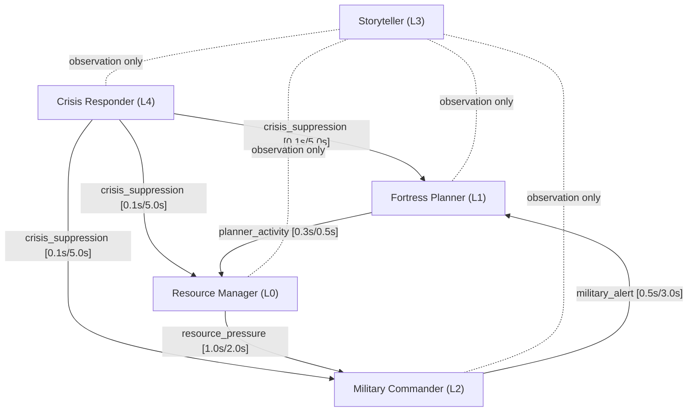

# Fortress Suppression Topology

**Status:** Design (suppression architecture specification)
**Date:** 2026-03-23
**Builds on:** Multi-Role Composition Design, Fortress Governance Chains, Perception Primitives Design

---

## 1. Brooks' Subsumption Mapping for DF

The Dwarf Fortress role hierarchy maps to a five-layer subsumption architecture. Each layer operates autonomously and can be removed without affecting layers below it.

Layer ordering (base to top):

```
Layer 0 (Base):     Resource Manager — always running, monitors food/drink/labor
Layer 1:            Fortress Planner — spatial expansion, construction
Layer 2:            Military Commander — defense, training, threat response
Layer 3:            Storyteller — narrative generation (never suppresses others)
Layer 4 (Top):      Crisis Responder — emergency override, suppresses all lower layers
```

Advisor is queryable, not autonomous. It does not participate in the subsumption stack.

Storyteller occupies L3 but publishes no suppression signals. It functions as an observation-only role: it reads state from all layers but never modifies their behavior.

Key property: removing any layer leaves all lower layers functional. Remove Storyteller and the fortress operates identically. Remove Military Commander and the fortress still builds and manages resources. Remove Fortress Planner and the fortress still manages existing resources. This is the defining characteristic of subsumption: each layer adds competence without creating dependency.

---

## 2. Suppression Field Definitions

Each suppression relationship is defined by the following parameters:

- **Source chain:** the role that generates the suppression signal.
- **Target chain:** the role whose action threshold is raised.
- **Attack time:** how rapidly suppression engages after trigger conditions are met.
- **Release time:** how rapidly suppression relaxes after trigger conditions clear.
- **Effective threshold formula:** `base + supp * (1 - base)`, consistent with the existing SuppressionField implementation.
- **Asymmetry rationale:** whether attack is faster or slower than release, and why.

### 2.1 `crisis_suppression` (Crisis Responder -> ALL)

| Parameter | Value |
|-----------|-------|
| Source | Crisis Responder (L4) |
| Target | Fortress Planner, Resource Manager, Military Commander |
| Attack | 0.1s (near-instant) |
| Release | 5.0s (slow) |

**Effect:** Raises all action thresholds toward 1.0. Only the most critical actions pass through the suppression field during crisis.

**Asymmetry rationale:** Attack is 50x faster than release. Crisis conditions (siege, famine, tantrum spiral) require immediate redirection of all fortress resources. The slow release prevents premature resumption of expansion or drafting while the crisis is still resolving. A siege may appear to end (attackers retreat) only to resume within seconds; the 5.0s release time absorbs these false terminations.

### 2.2 `military_alert` (Military Commander -> Fortress Planner)

| Parameter | Value |
|-----------|-------|
| Source | Military Commander (L2) |
| Target | Fortress Planner (L1) |
| Attack | 0.5s (medium) |
| Release | 3.0s (medium) |

**Effect:** Suppresses spatial expansion. New room designation, tunnel digging, and construction projects are delayed until the military threat clears.

**Asymmetry rationale:** Attack is 6x faster than release. Military mobilization requires time to assess threat severity before suppressing construction, but the delay is modest because exposed construction sites create tactical vulnerabilities (breached walls, unfinished fortifications). The 3.0s release ensures the threat is genuinely neutralized before construction resumes.

### 2.3 `resource_pressure` (Resource Manager -> Military Commander)

| Parameter | Value |
|-----------|-------|
| Source | Resource Manager (L0) |
| Target | Military Commander (L2) |
| Attack | 1.0s (slow) |
| Release | 2.0s (medium) |

**Effect:** Raises the drafting threshold. During food or drink shortages, the Military Commander is discouraged from drafting civilians into military service.

**Asymmetry rationale:** Attack is 2x faster than release. Food shortage develops gradually and the suppression signal should not trigger on momentary fluctuations, hence the 1.0s attack. Release is moderately fast because once food stabilizes, the fortress should be able to resume military operations without excessive delay. Drafting food producers during famine accelerates the mortality rate and can produce a terminal feedback loop.

### 2.4 `planner_activity` (Fortress Planner -> Resource Manager)

| Parameter | Value |
|-----------|-------|
| Source | Fortress Planner (L1) |
| Target | Resource Manager (L0) |
| Attack | 0.3s (fast) |
| Release | 0.5s (fast) |

**Effect:** Mildly suppresses labor reassignment. Workers currently assigned to active construction projects are less likely to be pulled for other tasks.

**Asymmetry rationale:** Attack and release are both fast, with attack 1.7x faster. Construction task assignment is immediate (a dwarf begins hauling materials as soon as a project is designated), so the suppression must engage quickly. Release is equally fast because completed construction frees workers immediately. The suppression magnitude is intentionally mild: Resource Manager at L0 must retain the ability to override if food production is critically low.

---

## 3. Suppression Topology Diagram

The directed suppression graph:



Edge labels indicate `[attack_time / release_time]`.

Note on upward suppression: Resource Manager (L0) suppresses Military Commander (L2). This breaks pure Brooks' layering, in which higher layers suppress lower layers but not the reverse. The deviation is intentional. Food is more fundamental than military capability. Without food, military is inoperative regardless of suppression topology. This makes Resource Manager's L0 position (base competence) both correct and appropriately empowered to constrain higher layers when survival resources are insufficient.

---

## 4. Comparison to Studio Topology

| Studio Suppression | Fortress Suppression | Mapping Quality |
|--------------------|---------------------|-----------------|
| `conversation_suppression` (L3 -> L2) | `crisis_suppression` (L4 -> ALL) | Same primitive, different scope. Studio suppresses one layer; fortress suppresses all lower layers. |
| `mc_activity` (L2 -> L1, unwired) | `military_alert` (L2 -> L1) | Direct analog. The studio architecture defined this field but never connected it. Fortress wires it. |
| `monitoring_alert` (L0 -> L2, unwired) | `resource_pressure` (L0 -> L2) | Direct analog. Same upward-suppression pattern, same layer indices. Fortress wires it. |
| -- | `planner_activity` (L1 -> L0) | No studio analog. Construction-specific suppression with no equivalent in the studio domain. |

Key observation: Dwarf Fortress forces the wiring of suppression fields that exist in the studio architecture but were never connected. Two of the four fortress suppression fields (`military_alert`, `resource_pressure`) are direct analogs of studio fields that remained unwired. This validates the forcing function thesis: a sufficiently complex second domain exposes latent architectural capacity that the original domain did not exercise.

---

## 5. Stability Analysis

The suppression topology must not oscillate. Five properties ensure stability:

1. **No circular suppression paths in the primary topology.** The graph contains no cycles when considering only downward suppression. Crisis Responder suppresses all lower layers unidirectionally. Military Commander suppresses Fortress Planner unidirectionally.

2. **The L0-L2 bidirectional path has domain separation.** Resource Manager (L0) suppresses Military Commander (L2) via `resource_pressure`, while Military Commander (L2) suppresses Fortress Planner (L1), not Resource Manager. There is no direct L2 -> L0 suppression. The L1 -> L0 path (`planner_activity`) creates an indirect L0 -> L2 -> L1 -> L0 cycle through three nodes, but the asymmetric timing (1.0s + 0.5s + 0.3s = 1.8s total loop delay) combined with the mild suppression magnitude of `planner_activity` prevents resonance.

3. **FreshnessGuard prevents stale readings from driving suppression.** A suppression signal that has not been refreshed within its validity window decays to zero rather than persisting at its last value. This eliminates the failure mode where a crashed role leaves permanent suppression on its targets.

4. **SuppressionField smoothing uses linear ramp, not step function.** Suppression transitions are continuous, preventing the discontinuities that would arise from instantaneous threshold changes. This is particularly relevant for the L0-L1 bidirectional interaction, where step-function suppression could produce alternating states.

5. **Different trigger domains prevent simultaneous firing.** Resource Manager operates on tick-based evaluation (periodic resource inventory). Military Commander operates on event-driven evaluation (threat detection). Fortress Planner operates on task-completion events. These distinct trigger domains make simultaneous multi-field activation unlikely outside of genuine crisis conditions, where Crisis Responder's L4 override resolves any conflict.

---

## 6. Tuning Parameters

All values specified in this document are defaults, chosen conservatively. They are documented as configuration parameters, not constants, and are adjustable via `FortressConfig`.

| Parameter | Default | Range | Notes |
|-----------|---------|-------|-------|
| `crisis_suppression.attack` | 0.1s | [0.01, 1.0] | Near-instant by design |
| `crisis_suppression.release` | 5.0s | [1.0, 30.0] | Must exceed longest false-termination window |
| `military_alert.attack` | 0.5s | [0.1, 2.0] | Balances responsiveness against false positives |
| `military_alert.release` | 3.0s | [1.0, 10.0] | Must exceed combat engagement duration |
| `resource_pressure.attack` | 1.0s | [0.5, 5.0] | Slow enough to absorb momentary fluctuations |
| `resource_pressure.release` | 2.0s | [0.5, 5.0] | Fast enough to resume military when stable |
| `planner_activity.attack` | 0.3s | [0.1, 1.0] | Fast to prevent mid-task worker theft |
| `planner_activity.release` | 0.5s | [0.1, 2.0] | Fast to free workers after completion |
| Suppression floor | 0.0 | [0.0, 0.1] | Never fully suppress a role |
| Suppression ceiling | 0.95 | [0.8, 1.0] | 5% residual ensures catastrophic-event response |

The suppression floor of 0.0 means no role is ever fully suppressed. Even during crisis, Resource Manager retains the ability to handle absolute survival minimums (e.g., a dwarf dying of thirst). The suppression ceiling of 0.95 ensures that 5% residual capacity remains in every suppressed role, allowing response to catastrophic events that occur while the role is suppressed.

---

## 7. Relation to Existing SuppressionField Implementation

No changes to `suppression.py` are required. The SuppressionField primitive is domain-agnostic: it accepts attack time, release time, and a suppression magnitude, and produces a smoothed threshold modifier. It does not encode any knowledge of whether it is suppressing MC vocal levels or fortress expansion rates.

The fortress domain requires only new wiring: instantiation of SuppressionField objects with the parameters defined in this document, connected to the appropriate role chains. The primitive itself remains unchanged.

This validates the architectural generality claim stated in the Perception Primitives Design: the same L5 primitive serves both studio and fortress domains without modification. Domain specificity resides entirely in the wiring configuration, not in the suppression mechanism.
